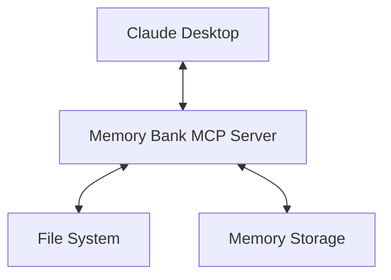

# Claude Desktop Memory Bank

An MCP server that helps Claude Desktop maintain context across sessions, inspired by Cline Memory Bank.

## Overview

Claude Desktop Memory Bank is a Model Context Protocol (MCP) server that provides persistent memory capabilities. It stores project context in structured files, allowing Claude to access information from previous sessions. This maintains continuity in long-running projects and improves Claude's context awareness.



## Features

- **Project-based Context Management**: Organize context by projects
- **Structured Memory**: Store context in categorized files (project brief, technical context, active context, progress)
- **MCP Integration**: Seamless integration with Claude Desktop
- **Search Capabilities**: Find relevant context across project files
- **Contextual Templates**: Standardized templates for project documentation

## How It Works

The Memory Bank implements three MCP capabilities:

1. **Resources**: Project briefs, technical context, active context, and progress information
2. **Tools**: Functions to create/update context, search memory, and manage projects
3. **Prompts**: Templates for standardizing information structure

## Installation

### Prerequisites

- Claude Desktop application
- Python 3.8+
- Node.js

### Quick Start

1. Clone this repository:
   ```bash
   git clone https://github.com/yourusername/claude-desktop-memory-bank.git
   cd claude-desktop-memory-bank
   ```

2. Install the server:
   ```bash
   pip install -e .
   ```

3. Configure Claude Desktop (`claude_desktop_config.json`):
   ```json
   {
     "mcpServers": {
       "memory-bank": {
         "command": "python",
         "args": ["-m", "memory_bank_server"],
         "env": {
           "MEMORY_BANK_ROOT": "/path/to/storage"
         }
       }
     }
   }
   ```

4. Restart Claude Desktop

## Documentation

- [MCP Design Document](doc/mcp-design.md): Architecture overview
- [Implementation Guide](doc/implementation-guide.md): Developer documentation
- [Usage Guide](doc/usage-guide.md): User instructions

## License

[MIT License](LICENSE)

## Acknowledgments

- Inspired by Cline Memory Bank
- Built on Model Context Protocol (MCP) by Anthropic
