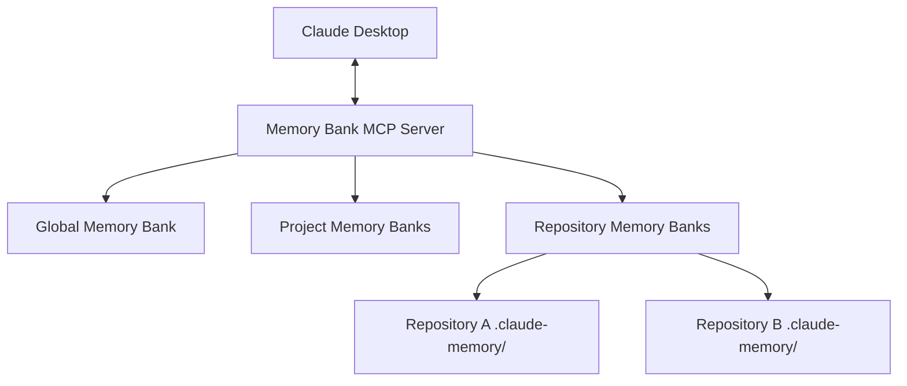

# Claude Desktop Memory Bank

An MCP server that helps Claude Desktop maintain context across sessions, supporting global, project-specific, and repository-based memory banks.

## Overview

Claude Desktop Memory Bank is a Model Context Protocol (MCP) server that provides persistent memory capabilities across different contexts. It supports three types of memory banks:

1. **Global Memory Bank**: For general conversations not tied to specific projects
2. **Project Memory Banks**: Linked to Claude Desktop projects
3. **Repository Memory Banks**: Located inside Git repositories (`.claude-memory` directories)



## Features

- **Multi-Source Context Management**: Choose the right memory bank for your workflow
- **Repository Integration**: Store context directly with your code in Git repositories
- **Project-Based Organization**: Dedicated memory banks for Claude Desktop projects
- **Global Context**: Maintain general knowledge across all conversations
- **Smart Memory Bank Selection**: Automatically selects the appropriate memory bank based on context
- **Repository Detection**: Identifies Git repositories and can initialize memory banks in them

## How It Works

The Memory Bank implements the MCP specification with specialized support for multiple memory sources:

1. **Resources**: Project briefs, technical context, active context, and progress information
2. **Tools**: Memory bank selection, repository detection, context management
3. **Prompts**: Templates for project briefs, updates, and repository association

## Installation

### Prerequisites

- Claude Desktop application
- Python 3.8+
- Node.js
- Git (for repository memory banks)

### Quick Start

1. Clone this repository:
   ```bash
   git clone https://github.com/yourusername/claude-desktop-memory-bank.git
   cd claude-desktop-memory-bank
   ```

2. Install the server:
   ```bash
   pip install -e .
   ```

3. Configure Claude Desktop (`claude_desktop_config.json`):
   ```json
   {
     "mcpServers": {
       "memory-bank": {
         "command": "python",
         "args": ["-m", "memory_bank_server"],
         "env": {
           "MEMORY_BANK_ROOT": "/path/to/storage",
           "ENABLE_REPO_DETECTION": "true"
         }
       }
     }
   }
   ```

4. Restart Claude Desktop

## Usage

### Memory Bank Selection

The system automatically selects the appropriate memory bank:

- If working in a Claude Desktop project with an associated repository, uses the repository memory bank
- If working in a Claude Desktop project without a repository, uses the project memory bank
- For general conversations, uses the global memory bank

You can also explicitly select a memory bank:

```
Please switch to the repository memory bank for /path/to/my/repo
```

### Repository Integration

Store memory banks directly in your Git repositories:

1. Tell Claude about your repository:
   ```
   I'm working on code in the repository at /path/to/repo
   ```

2. Initialize a memory bank:
   ```
   Please initialize a memory bank for this repository
   ```

3. Claude creates a `.claude-memory` directory with context files
4. Memory bank files can be committed to Git for sharing

## Documentation

- [MCP Design Document](doc/mcp-design.md): Architecture overview with updated multi-source design
- [Implementation Guide](doc/implementation-guide.md): Detailed developer documentation for all memory bank types
- [Usage Guide](doc/usage-guide.md): Complete instructions for using different memory bank types

## License

[MIT License](LICENSE)

## Acknowledgments

- Inspired by Cline Memory Bank
- Built on Model Context Protocol (MCP) by Anthropic
