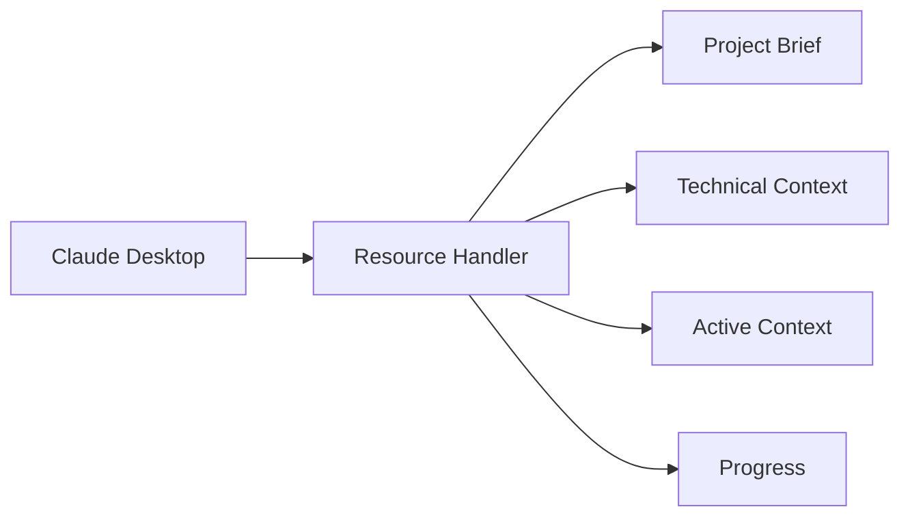
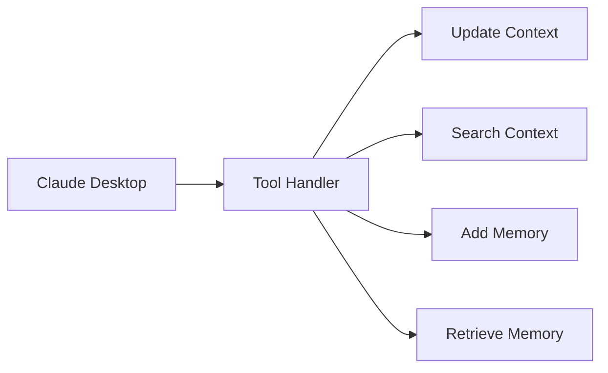
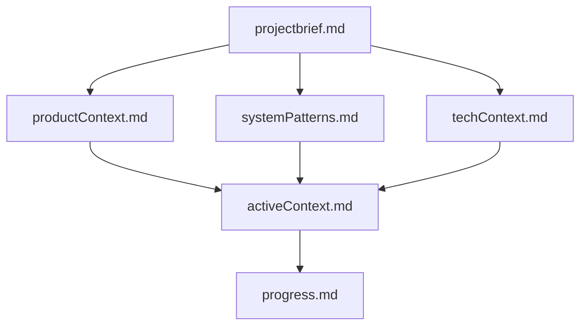
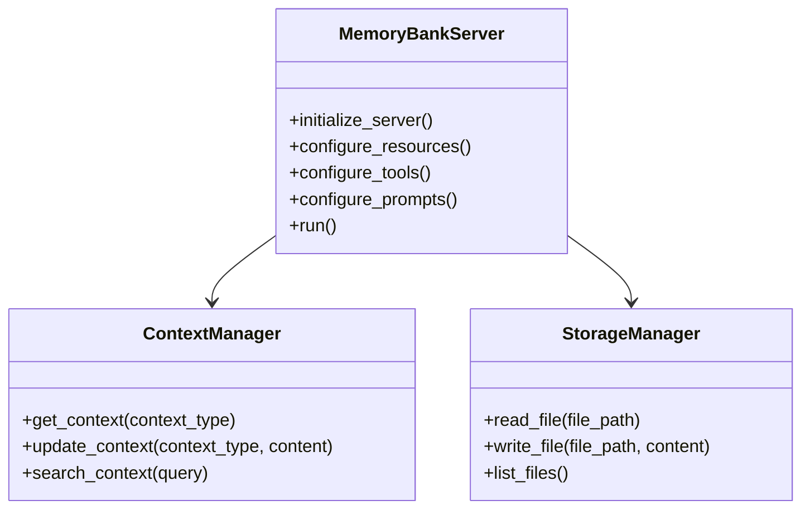
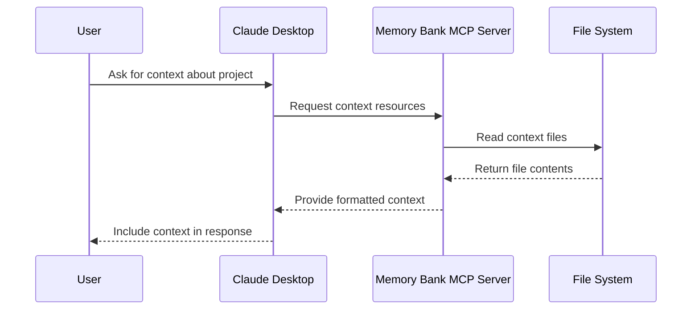
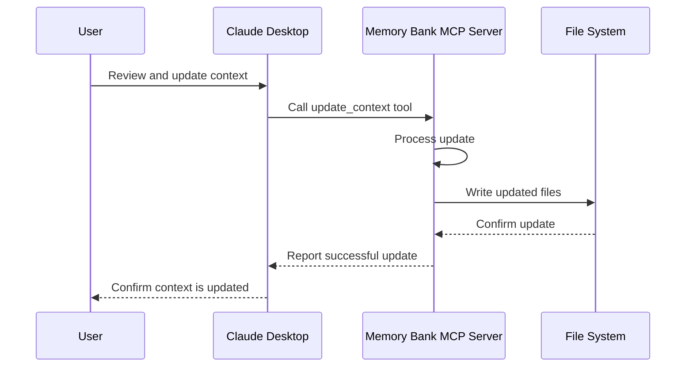
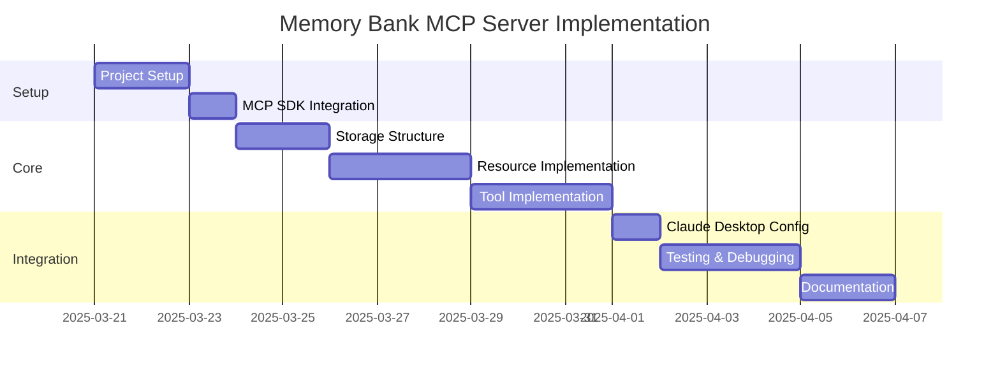

# Claude Desktop Memory Bank - MCP Server Design

## Introduction

The Claude Desktop Memory Bank is a specialized Model Context Protocol (MCP) server designed to help Claude Desktop maintain context and memory across sessions. This document outlines the architecture and implementation approach for this MCP server, drawing inspiration from the Cline Memory Bank concept while following the standardized MCP specification.

## What is MCP?

The Model Context Protocol (MCP) is an open standard developed by Anthropic that standardizes how applications provide context to LLMs. It functions like a "USB-C port for AI applications," providing a standardized way to connect AI models with various data sources and tools.

MCP addresses the challenge of AI systems being isolated from data sources by providing a universal, open standard for connecting AI systems with data sources, replacing fragmented integrations with a single protocol.

## System Architecture Overview

The Memory Bank MCP server will follow the standard MCP architecture pattern:

```mermaid
flowchart TD
    Claude[Claude Desktop] <--> CMCP[Claude Memory Bank MCP Server]
    CMCP <--> FS[File System]
    
    subgraph Memory Bank
        MS[Memory Storage]
        TS[Tool Services]
        PS[Prompt Services]
    end
    
    CMCP <--> Memory Bank
```

## Core Components

The Claude Desktop Memory Bank MCP server will implement these core MCP capabilities:

### 1. Resources

Resources in MCP are file-like data that can be read by clients. Our Memory Bank server will expose:

- **Project Brief Resource**: Provides high-level information about the current project
- **Technical Context Resource**: Offers technical context about the project
- **Active Context Resource**: Delivers the current working context
- **Progress Resource**: Shows what's been done and what's still to be completed



### 2. Tools

MCP Tools are functions that can be called by the LLM (with user approval). Our server will provide:

- **Update Context Tool**: Allows Claude to update the memory bank with new information
- **Search Context Tool**: Enables searching through past context
- **Add Memory Tool**: Lets Claude store new information in the memory bank
- **Retrieve Memory Tool**: Allows Claude to fetch specific memories



### 3. Prompts

MCP Prompts are pre-written templates that help users interact with the server. Our server will include:

- **Project Brief Template**: Guide for creating an initial project brief
- **Context Summary Template**: Format for summarizing current context
- **Progress Update Template**: Structure for updating progress

## Data Structure

The memory bank data will be organized in a structured way using markdown files:



## Implementation Approach

We'll implement the Claude Desktop Memory Bank using the official MCP Python SDK. The implementation will follow these steps:

1. **Set up the MCP server framework**
2. **Define resources to expose memory bank files**
3. **Implement tools for context manipulation**
4. **Add prompts for standardized interactions**
5. **Implement file-based storage**
6. **Design serialization/deserialization logic**

## Server Implementation Details

The server will be implemented using Python and the official MCP Python SDK:



## Core Workflow

### Context Retrieval Workflow



### Context Update Workflow



## Integration with Claude Desktop

To integrate with Claude Desktop, we'll need to:

1. Install the Claude Desktop application
2. Create a configuration entry in `claude_desktop_config.json`
3. Configure the Memory Bank server path

Example configuration:

```json
{
  "mcpServers": {
    "memory-bank": {
      "command": "python",
      "args": ["-m", "memory_bank_server", "--root-dir", "/path/to/memory-bank"],
      "env": {
        "MEMORY_BANK_CONFIG": "/path/to/config.json"
      }
    }
  }
}
```

## Implementation Plan

The implementation will follow these steps:



## Future Enhancements

After the initial implementation, we could consider these enhancements:

1. **Advanced Context Selection**: Implement more sophisticated algorithms to select the most relevant context
2. **Embedding-Based Search**: Use embeddings to improve context searching
3. **Context Versioning**: Track changes to context over time
4. **Multi-Project Support**: Handle multiple projects with separate memory banks
5. **Remote Hosting**: Support for remote hosting when MCP supports it

## Conclusion

The Claude Desktop Memory Bank MCP server provides a standardized way for Claude to maintain context across sessions using the Model Context Protocol. By following the MCP specification, we ensure compatibility with Claude Desktop and potential future MCP clients.

Unlike the original design which tried to mimic Cline Memory Bank through a custom architecture, this approach leverages the standardized MCP protocol while still achieving the goal of persistent context management for Claude Desktop.
