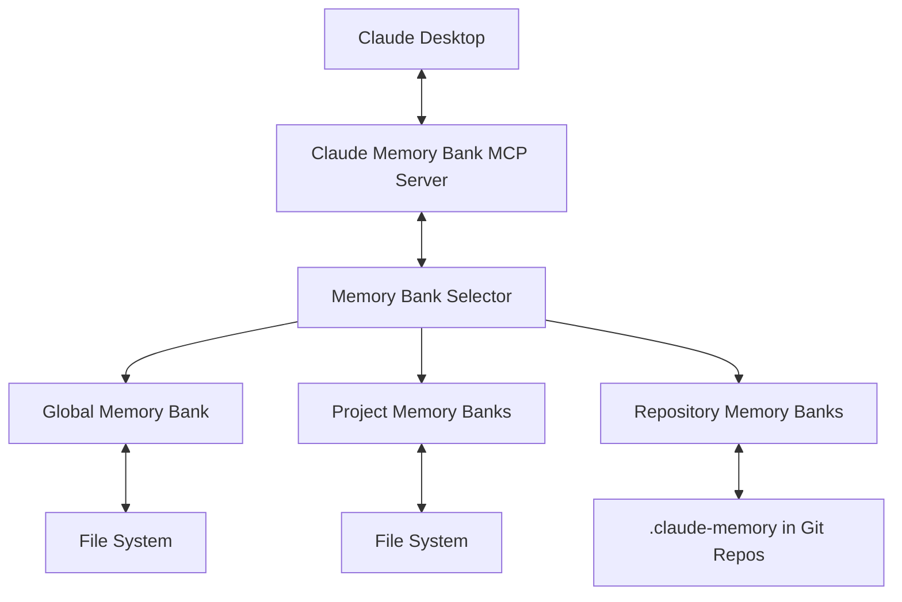
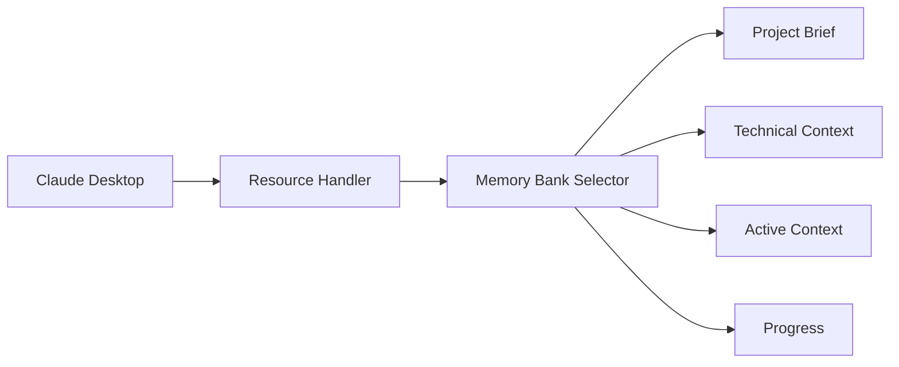
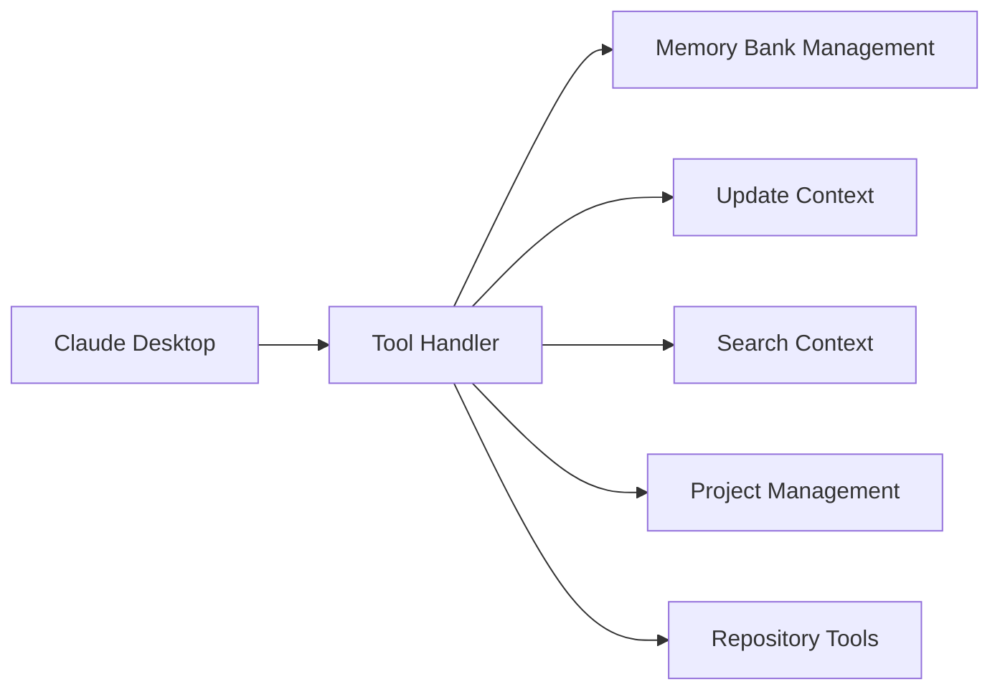
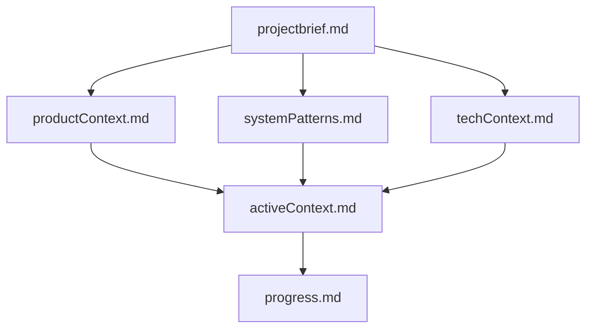
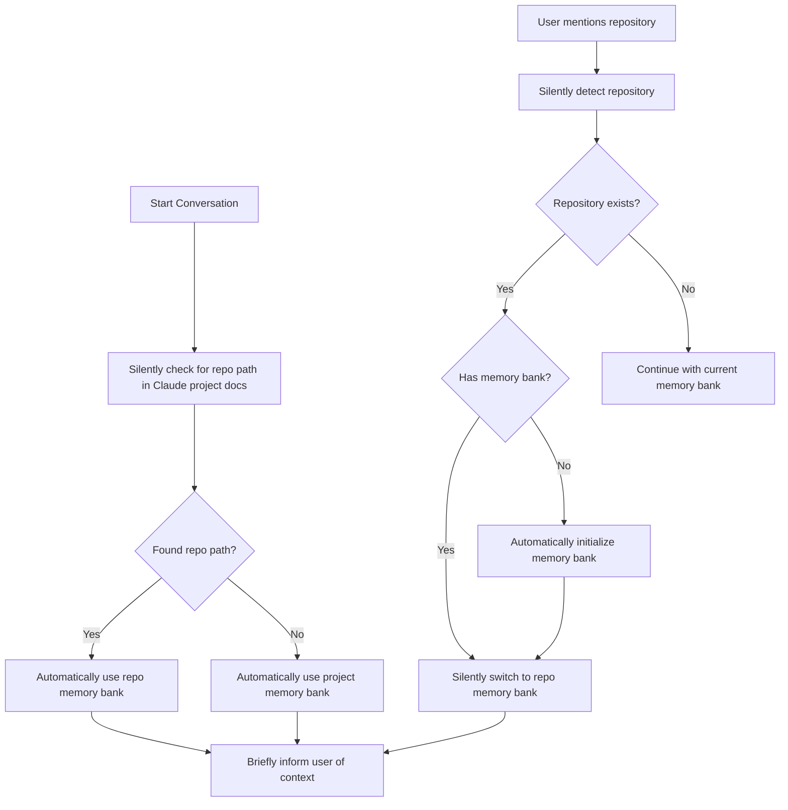
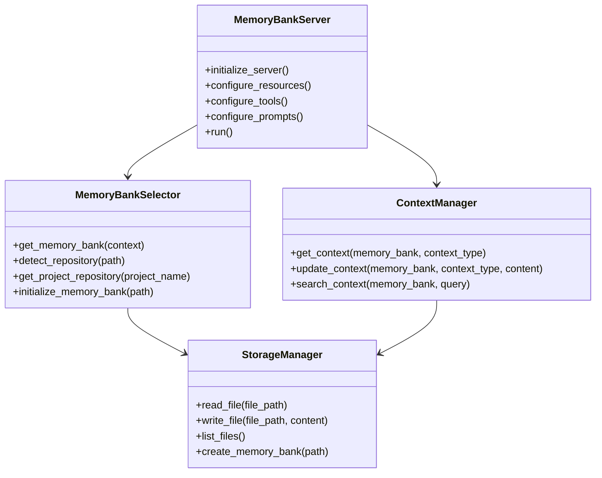
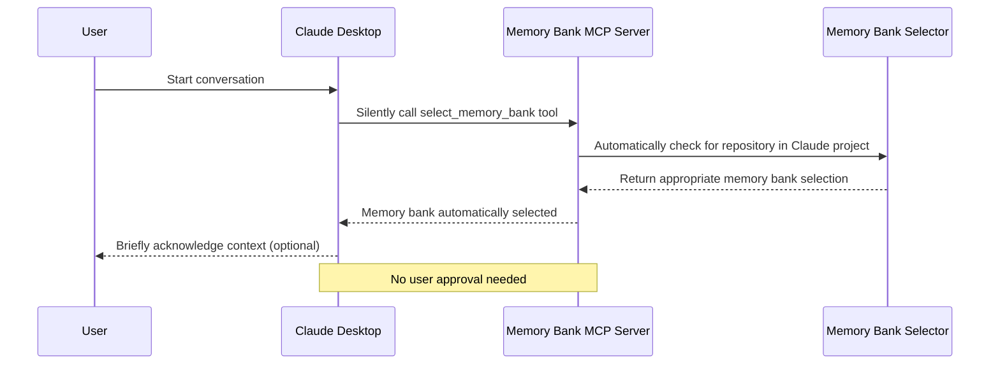
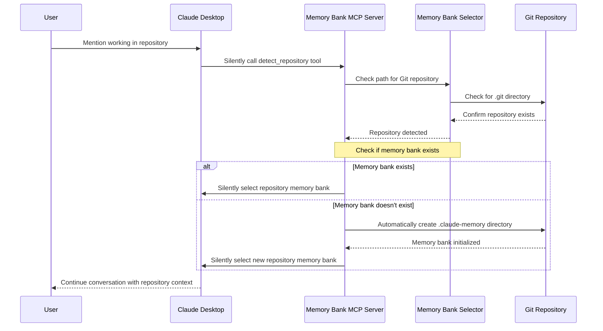
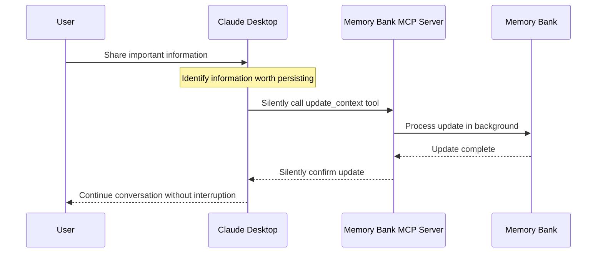

# Claude Desktop Memory Bank - MCP Server Design

## Introduction

The Claude Desktop Memory Bank is a specialized Model Context Protocol (MCP) server designed to help Claude Desktop maintain context and memory across sessions. This document outlines the architecture and implementation approach for this MCP server, drawing inspiration from the Cline Memory Bank concept while following the standardized MCP specification.

## What is MCP?

The Model Context Protocol (MCP) is an open standard developed by Anthropic that standardizes how applications provide context to LLMs. It functions like a "USB-C port for AI applications," providing a standardized way to connect AI models with various data sources and tools.

MCP addresses the challenge of AI systems being isolated from data sources by providing a universal, open standard for connecting AI systems with data sources, replacing fragmented integrations with a single protocol.

## System Architecture Overview

The Memory Bank MCP server follows the standard MCP architecture pattern, with support for multiple memory bank sources:



## Memory Bank Types

The system supports three types of memory banks:

1. **Global Memory Bank**: Used for general conversations not associated with any specific project
2. **Project Memory Banks**: Linked to Claude Desktop projects for project-specific conversations
3. **Repository Memory Banks**: Located within Git repositories for code-related conversations

## Core Components

The Claude Desktop Memory Bank MCP server implements these core MCP capabilities:

### 1. Resources

Resources in MCP are file-like data that can be read by clients. Our Memory Bank server exposes:

- **Project Brief Resource**: Provides high-level information about the current project
- **Technical Context Resource**: Offers technical context about the project
- **Active Context Resource**: Delivers the current working context
- **Progress Resource**: Shows what's been done and what's still to be completed



### 2. Tools

MCP Tools are functions that can be called by the LLM (with user approval). Our server provides:

- **Memory Bank Management Tools**: Select, initialize, and list available memory banks
- **Update Context Tool**: Allows Claude to update the memory bank with new information
- **Search Context Tool**: Enables searching through past context
- **Project Management Tools**: Create and manage project-specific memory banks
- **Repository Detection Tool**: Detect and initialize repository memory banks



### 3. Prompts

MCP Prompts are pre-written templates that help users interact with the server:

- **Project Brief Template**: Guide for creating an initial project brief
- **Context Summary Template**: Format for summarizing current context
- **Progress Update Template**: Structure for updating progress

## Data Structure

The memory bank data is organized in a structured way using markdown files. This structure is replicated across all memory bank types:



## Storage Structure

The file system structure accommodates multiple memory bank types:

```
memory-bank/
├── global/                 # Global memory bank
│   ├── projectbrief.md
│   ├── productContext.md
│   └── ...
├── projects/               # Project-specific memory banks
│   ├── project1/
│   │   ├── projectbrief.md
│   │   └── ...
│   └── project2/
│       ├── projectbrief.md
│       └── ...
└── repositories/           # Symlinks or records of git repositories
    ├── repo1 -> /path/to/repo1/.claude-memory
    └── repo2 -> /path/to/repo2/.claude-memory
```

For repositories, the actual memory bank files are stored within the repository itself:

```
repository/
├── .claude-memory/         # Repository memory bank
│   ├── projectbrief.md
│   ├── productContext.md
│   └── ...
├── src/
└── ...
```

## Autonomous Memory Bank Selection

The memory bank selection follows an automatic approach with minimal user interaction:



When Claude selects a memory bank, it:
1. Automatically checks if the conversation is associated with a Claude Desktop Project
2. If yes, checks if the project has a configured repository path
3. If a repository path exists, uses that repository's memory bank without asking for confirmation
4. If no repository path exists, uses the project memory bank
5. If a repository is mentioned during conversation, automatically switches to that repository's memory bank
6. Operates seamlessly in the background without requiring explicit user approval

## Implementation Approach

We'll implement the Claude Desktop Memory Bank using the official MCP Python SDK. The implementation will follow these steps:

1. **Set up the MCP server framework**
2. **Implement memory bank selection logic**
3. **Define resources to expose memory bank files**
4. **Implement tools for context manipulation and memory bank selection**
5. **Add prompts for standardized interactions**

## Server Implementation Details

The server will be implemented using Python and the official MCP Python SDK:



## Core Workflows

### Autonomous Memory Bank Selection Workflow



### Autonomous Repository Detection Workflow



### Automatic Context Update Workflow



## Integration with Claude Desktop

To integrate with Claude Desktop, the configuration will include options for global and repository memory banks:

```json
{
  "mcpServers": {
    "memory-bank": {
      "command": "python",
      "args": ["-m", "memory_bank_server"],
      "env": {
        "GLOBAL_MEMORY_PATH": "/path/to/global/memory",
        "ENABLE_REPO_DETECTION": "true"
      }
    }
  }
}
```

## Repository Integration

For repository integration, we'll use Git to detect repositories and place memory banks directly within them:

1. **Repository Detection**: Check for `.git` directories to identify repositories
2. **Memory Bank Location**: Store memory banks in `.claude-memory` at the repository root
3. **Path Resolution**: Support both absolute and relative paths to repositories
4. **Project Association**: Allow linking Claude Desktop Projects to specific repositories

## Future Enhancements

After the initial implementation, we could consider these enhancements:

1. **Advanced Context Selection**: Implement more sophisticated algorithms to autonomously select the most relevant context
2. **Intelligent Context Summary**: Automatically generate summaries of past discussions when needed
3. **Embedding-Based Search**: Use embeddings to improve context searching without requiring explicit queries
4. **Context Versioning**: Silently track changes to context over time
5. **Git Integration**: Automatically store memory bank changes as Git commits
6. **Collaborative Memory Banks**: Seamless support for shared memory banks in team environments
7. **Context Importance Scoring**: Automatically determine which information is most important to persist
8. **Remote Hosting**: Support for transparent remote hosting when MCP supports it

## Conclusion

The Claude Desktop Memory Bank MCP server provides an autonomous memory system that enables Claude to maintain context across sessions using the Model Context Protocol. The system operates in the background with minimal user interaction, creating a seamless experience where context persists naturally across conversations.

This autonomous approach significantly reduces the cognitive load on users by eliminating the need to explicitly manage Claude's memory, allowing for more natural and productive interactions.
