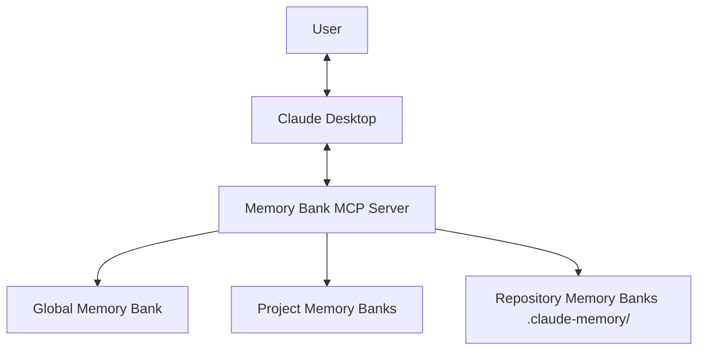
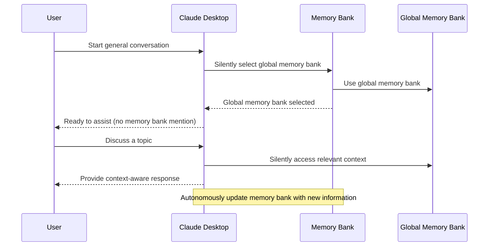
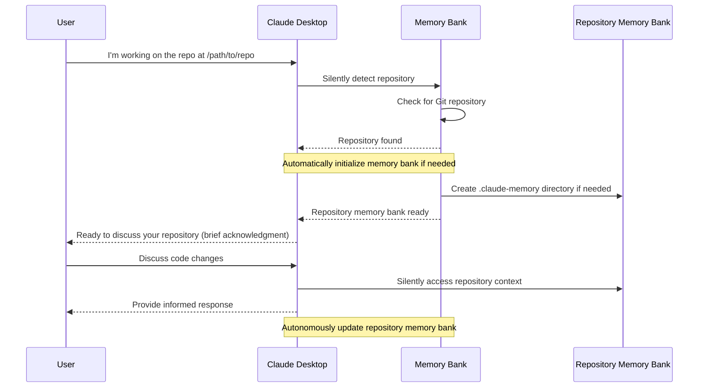

# Claude Desktop Memory Bank - Usage and Tools Guide

This comprehensive guide explains how to use the Claude Desktop Memory Bank system and provides detailed documentation for all available MCP tools.

## Introduction

The Claude Desktop Memory Bank is a Model Context Protocol (MCP) server that enables Claude to maintain context and memory across sessions. It functions as Claude's auxiliary memory, automatically storing and organizing important information without requiring user management.

The system supports three types of memory banks:
1. **Global Memory Bank**: For general conversations not tied to specific projects
2. **Project Memory Banks**: Linked to Claude Desktop projects
3. **Repository Memory Banks**: Located inside Git repositories for code-related work



## Installation

### Prerequisites

- Claude Desktop app installed
- Python 3.8 or newer
- Node.js (required for Claude Desktop MCP integration)
- Git (for repository memory banks)

### Installation Steps

1. **Clone the repository**:
   ```bash
   git clone https://github.com/yourusername/claude-desktop-memory-bank.git
   cd claude-desktop-memory-bank
   ```

2. **Install the memory bank server**:
   ```bash
   pip install -e .
   ```

3. **Configure Claude Desktop**:
   
   Locate the Claude Desktop configuration file:
   - **macOS**: `~/Library/Application Support/Claude/claude_desktop_config.json`
   - **Windows**: `%APPDATA%\Claude\claude_desktop_config.json`
   
   Add the memory bank server configuration:
   ```json
   {
     "mcpServers": {
       "memory-bank": {
         "command": "python",
         "args": ["-m", "memory_bank_server"],
         "env": {
           "MEMORY_BANK_ROOT": "/path/to/your/storage/directory",
           "ENABLE_REPO_DETECTION": "true"
         }
       }
     }
   }
   ```

4. **Restart Claude Desktop**:
   Close and reopen the Claude Desktop application.

## Memory Bank Types

### Global Memory Bank

The global memory bank is used for general conversations that aren't associated with a specific project or repository:

- Used by default when no other memory bank is specified
- Stores general context that can be accessed across conversations
- Provides continuity for non-project-specific discussions

### Project Memory Banks

Project memory banks are linked to Claude Desktop projects:

- Each Claude Desktop project can have its own dedicated memory bank
- Stores project-specific context, progress, and technical details
- Automatically loaded when you switch to a Claude Desktop project

### Repository Memory Banks

Repository memory banks are stored directly within Git repositories:

- Located in a `.claude-memory` directory at the repository root
- Context is stored with your code and can be committed to version control
- Ideal for development work where context should follow the codebase
- Can be associated with Claude Desktop projects for easy access

## How It Works

### Autonomous Memory Bank Selection

When starting a conversation, Claude automatically selects the appropriate memory bank:

1. **In a Claude Desktop Project**:
   - If the project has an associated repository, Claude uses the repository memory bank
   - If no repository is associated, Claude uses the project memory bank
   - Claude briefly informs you which memory bank is being used

2. **Outside of a Project**:
   - Claude uses the global memory bank by default
   - You can mention a specific project or repository to switch contexts

3. **Working with a Repository**:
   - Simply mention the repository you're working with
   - Claude automatically detects Git repositories and initializes memory banks if needed
   - The repository memory bank is selected without requiring confirmation

### Creating Your First Project Memory Bank

1. **Open Claude Desktop** and start a new conversation
2. **Mention creating a project**:
   ```
   I'd like to create a new project called "MyProject"
   ```
3. **Claude automatically creates the project**:
   - Claude sets up the necessary memory bank structure
   - No confirmation steps needed
4. **Discuss your project**:
   ```
   This project will be a web application for tracking inventory
   ```
5. **Claude automatically stores important information** in the appropriate context files
6. **Information persists** for future conversations about this project

### Working with Repository Memory Banks

1. **Mention your repository**:
   ```
   I'm working on a project in the repository at /path/to/repo
   ```
2. **Claude automatically detects the repository**:
   - It checks if a memory bank already exists
   - If not, it initializes one without requiring confirmation
3. **Continue your conversation** about the code:
   - Claude remembers details about the repository
   - Important information is saved automatically
   - No explicit management required

### Connecting Projects and Repositories

Simply mention both in conversation:
```
My "InventoryApp" project uses the code in /path/to/inventory-repo
```

Claude automatically:
- Associates the project with the repository
- Ensures future conversations about this project use the repository memory bank
- Preserves this association for future sessions

## MCP Tools Reference

The Memory Bank system provides various MCP tools that enable Claude to manage memory banks and context information. While these tools typically work automatically in the background, understanding them can help troubleshoot issues or implement advanced workflows.

### memory-bank-start

Initializes the memory bank and loads a custom prompt.

#### Description

This tool orchestrates the initialization process for memory banks. It detects repositories, initializes memory banks when needed, selects the appropriate memory bank based on the detection, and loads a specified prompt or the default custom instructions.

#### Parameters

- **prompt_name** (optional): Name of the prompt to load. If not provided, the default custom instruction will be used.
- **auto_detect** (optional): Whether to automatically detect repositories. Default: `true`
- **current_path** (optional): Path to check for repository. Default: Current working directory
- **force_type** (optional): Force a specific memory bank type (`global`, `project`, or `repository`) overriding auto-detection.

#### Returns

A confirmation message about the initialization with details about the memory bank that was selected.

### select-memory-bank

Selects which memory bank to use for the conversation.

#### Description

This tool allows selecting a specific memory bank for the current conversation. It can be used to switch between global, project, and repository memory banks.

#### Parameters

- **type**: The type of memory bank to use (`global`, `project`, or `repository`)
- **project** (optional): The name of the project (for `project` type)
- **repository_path** (optional): The path to the repository (for `repository` type)

#### Returns

Information about the selected memory bank.

### create-project

Creates a new project in the memory bank.

#### Description

This tool creates a new project memory bank and optionally associates it with a Git repository.

#### Parameters

- **name**: The name of the project to create
- **description**: A brief description of the project
- **repository_path** (optional): Path to a Git repository to associate with the project

#### Returns

A confirmation message about the created project.

### list-memory-banks

Lists all available memory banks.

#### Description

This tool provides information about all available memory banks, including the current memory bank, global memory bank, project memory banks, and repository memory banks.

#### Parameters

None

#### Returns

A formatted list of all available memory banks with their details.

### detect-repository

Detects if a path is within a Git repository.

#### Description

This tool checks if a given path is within a Git repository and provides information about the repository if found.

#### Parameters

- **path**: The path to check

#### Returns

Information about the detected repository, or a message indicating no repository was found.

### initialize-repository-memory-bank

Initializes a memory bank within a Git repository.

#### Description

This tool creates a new memory bank within a Git repository and optionally associates it with a Claude Desktop project.

#### Parameters

- **repository_path**: Path to the Git repository
- **claude_project** (optional): Claude Desktop project to associate with this repository

#### Returns

Information about the initialized memory bank.

### update-context

Updates a context file in the current memory bank.

#### Description

This tool allows updating a specific context file (like project brief, technical context, etc.) in the current memory bank.

#### Parameters

- **context_type**: The type of context to update (`project_brief`, `product_context`, `system_patterns`, `tech_context`, `active_context`, or `progress`)
- **content**: The new content for the context file

#### Returns

A confirmation message about the updated context.


### bulk-update-context

Updates multiple context files in one operation.

#### Description

This tool allows updating multiple context files at once in the current memory bank.

#### Parameters

- **updates**: A dictionary mapping context types to their new content

#### Returns

A confirmation message about the bulk update.

### auto-summarize-context

Automatically extracts and updates context from conversation.

#### Description

This tool analyzes conversation text to extract relevant information and automatically update appropriate context files.

#### Parameters

- **conversation_text**: The text of the conversation to analyze

#### Returns

Information about what context files were updated and with what information.

### prune-context

Removes outdated information from context files.

#### Description

This tool removes outdated information from context files based on a configurable age threshold.

#### Parameters

- **max_age_days** (optional): Maximum age in days of content to keep. Default: 90

#### Returns

Information about what was pruned from which context files.

## Workflow Examples

### Autonomous Global Context Workflow



### Autonomous Repository Context Workflow



## Best Practices

### Getting the Most from Memory Banks

1. **Mention project and repository names clearly**:
   - "I'm working on the InventoryApp project"
   - "This is for the repository at /path/to/repo"

2. **Discuss important decisions explicitly**:
   - Architectural choices
   - Technical constraints
   - Project requirements
   - Implementation details

3. **For teams using shared repositories**:
   - Commit `.claude-memory` to Git for team sharing
   - Pull before starting new conversations to get latest context

## Troubleshooting

### Memory Bank Server Issues

If Claude seems to have forgotten previous context:

1. **Check server status**:
   - Ensure the memory bank server is running
   - Check configuration in `claude_desktop_config.json`

2. **Check logs** for errors:
   - Logs are at `~/Library/Logs/Claude/mcp-server-memory-bank.log` (macOS)
   - Or `%APPDATA%\Claude\logs` (Windows)

3. **Restart server if needed**:
   ```bash
   python -m memory_bank_server
   ```

### Repository Detection Issues

If Claude doesn't seem to recognize your repository:

1. **Use explicit absolute paths**:
   - `/home/user/projects/my-repo` instead of `~/projects/my-repo`

2. **Ensure repository has a `.git` directory**:
   - Must be a valid Git repository

3. **Check parent directories**:
   - Sometimes the root of the repository is higher than expected

## Conclusion

The Claude Desktop Memory Bank enhances your interactions with Claude by providing persistent context across sessions without requiring manual management. By automatically selecting appropriate memory banks and silently updating context, Claude provides a seamless experience where important information is remembered without explicit instructions.

This autonomous system lets you focus on your work rather than managing Claude's memory, creating a more natural and efficient collaboration experience.
