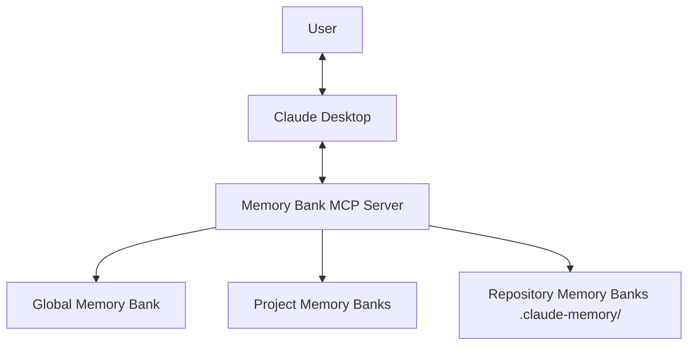
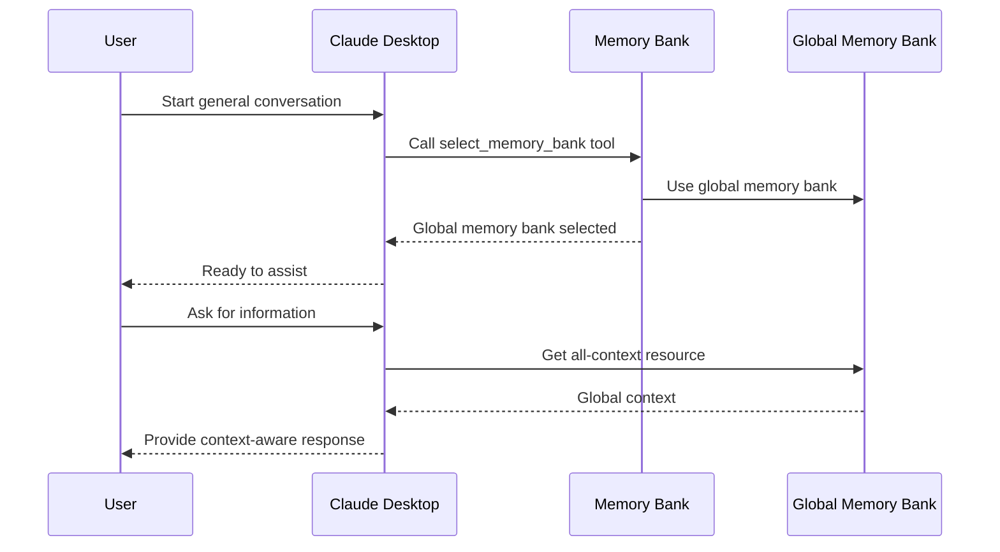
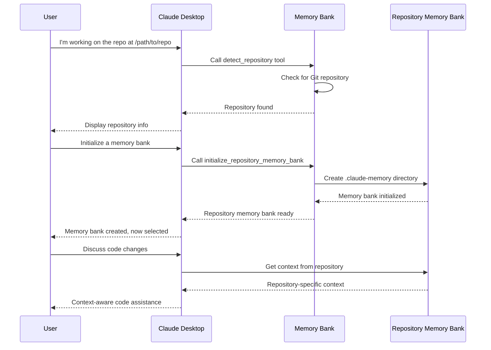
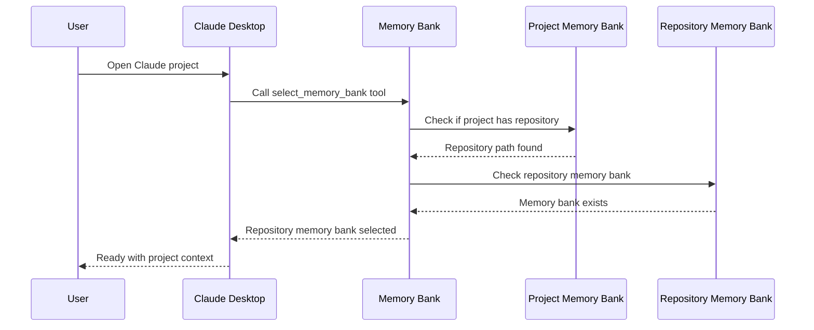

# Claude Desktop Memory Bank - Usage Guide

This guide explains how to use the Claude Desktop Memory Bank MCP server with Claude Desktop to maintain context across conversations.

## Introduction

The Claude Desktop Memory Bank is a Model Context Protocol (MCP) server that helps Claude Desktop maintain context and memory across sessions. It works by storing and organizing context in a structured format that Claude can access when needed.

The system supports three types of memory banks:
1. **Global Memory Bank**: For general conversations not tied to specific projects
2. **Project Memory Banks**: Linked to Claude Desktop projects
3. **Repository Memory Banks**: Located inside Git repositories for code-related work



## Installation

### Prerequisites

- Claude Desktop app installed
- Python 3.8 or newer
- Node.js (required for Claude Desktop MCP integration)
- Git (for repository memory banks)

### Installation Steps

1. **Clone the repository**:
   ```bash
   git clone https://github.com/yourusername/claude-desktop-memory-bank.git
   cd claude-desktop-memory-bank
   ```

2. **Install the memory bank server**:
   ```bash
   pip install -e .
   ```

3. **Configure Claude Desktop**:
   
   Locate the Claude Desktop configuration file:
   - **macOS**: `~/Library/Application Support/Claude/claude_desktop_config.json`
   - **Windows**: `%APPDATA%\Claude\claude_desktop_config.json`
   
   Add the memory bank server configuration:
   ```json
   {
     "mcpServers": {
       "memory-bank": {
         "command": "python",
         "args": ["-m", "memory_bank_server"],
         "env": {
           "MEMORY_BANK_ROOT": "/path/to/your/storage/directory",
           "ENABLE_REPO_DETECTION": "true"
         }
       }
     }
   }
   ```

4. **Restart Claude Desktop**:
   Close and reopen the Claude Desktop application.

## Memory Bank Types

### Global Memory Bank

The global memory bank is used for general conversations that aren't associated with a specific project or repository:

- Used by default when no other memory bank is specified
- Stores general context that can be accessed across conversations
- Provides continuity for non-project-specific discussions

### Project Memory Banks

Project memory banks are linked to Claude Desktop projects:

- Each Claude Desktop project can have its own dedicated memory bank
- Stores project-specific context, progress, and technical details
- Automatically loaded when you switch to a Claude Desktop project

### Repository Memory Banks

Repository memory banks are stored directly within Git repositories:

- Located in a `.claude-memory` directory at the repository root
- Context is stored with your code and can be committed to version control
- Ideal for development work where context should follow the codebase
- Can be associated with Claude Desktop projects for easy access

## Getting Started

### Memory Bank Selection

When starting a conversation, Claude will need to select which memory bank to use:

1. **In a Claude Desktop Project**:
   - If the project has an associated repository, Claude will use the repository memory bank
   - If no repository is associated, Claude will use the project memory bank
   - You can explicitly select a memory bank using the `select-memory-bank` tool

2. **Outside of a Project**:
   - Claude will use the global memory bank by default
   - You can switch to a specific project or repository memory bank if needed

3. **Working with a Repository**:
   - Tell Claude about the repository you're working on
   - Claude can detect Git repositories and initialize memory banks inside them
   - The repository memory bank will be used for the conversation

### Creating Your First Project Memory Bank

1. **Open Claude Desktop** and start a new conversation
2. **Create a project**:
   ```
   I'd like to create a new project in the memory bank called "MyProject"
   ```
3. **Claude will use the `create-project` tool**:
   - Claude will ask for permission to use the tool
   - It will prompt you for project details
4. **Create a project brief**:
   ```
   Can you help me create a detailed project brief?
   ```
5. **Claude will use the `create-project-brief` prompt** to provide a template
6. **Update the memory bank** with your project information

### Creating a Repository Memory Bank

1. **Tell Claude about your repository**:
   ```
   I'm working on a project in the repository at /path/to/repo
   ```
2. **Claude will detect the repository**:
   - It will use the `detect-repository` tool
   - It will tell you if a memory bank already exists
3. **Initialize a memory bank** if one doesn't exist:
   ```
   Please initialize a memory bank for this repository
   ```
4. **Claude will use the `initialize-repository-memory-bank` tool**:
   - It will create a `.claude-memory` directory
   - It will copy template files into it
5. **Start using the repository memory bank**:
   - Claude will switch to using this memory bank for the conversation
   - You can update and access context stored in the repository

### Associating a Repository with a Claude Project

1. **Create or select a Claude Desktop project**
2. **Tell Claude about the repository**:
   ```
   I want to associate this Claude project with my repository at /path/to/repo
   ```
3. **Claude will use the `associate-repository` prompt**:
   - It will guide you through linking the project and repository
4. **Confirm the association**:
   - Claude will update the project metadata
   - Future conversations in this project will use the repository memory bank

## Using Memory Banks

### Checking Current Memory Bank

To see which memory bank is currently in use:

```
What memory bank are we using right now?
```

Claude will use the `memory-bank-info` resource to provide information about:
- The current memory bank type (global, project, or repository)
- Repository details if using a repository memory bank
- Project details if using a project memory bank

### Switching Memory Banks

To switch to a different memory bank:

```
Can we switch to the global memory bank?
```

Or:

```
Let's use the memory bank for my project "MyProject"
```

Or:

```
Please switch to the repository memory bank for /path/to/repo
```

Claude will use the `select-memory-bank` tool to change memory banks.

### Managing Context

Once a memory bank is selected, you can:

1. **View context**:
   ```
   What does our project brief say?
   ```

2. **Update context**:
   ```
   Let's update the technical context with the new architecture decisions
   ```

3. **Search context**:
   ```
   Can you search the memory bank for anything related to "authentication"?
   ```

## Available Tools and Resources

### Tools

1. **`select-memory-bank`**: Choose which memory bank to use
   ```
   Parameters:
   - type: The type of memory bank ('global', 'project', or 'repository')
   - project: The name of the project (for 'project' type)
   - repository_path: The path to the repository (for 'repository' type)
   ```

2. **`create-project`**: Create a new project memory bank
   ```
   Parameters:
   - name: The name of the project
   - description: A brief description of the project
   - repository_path: Optional path to a Git repository
   ```

3. **`list-memory-banks`**: Show all available memory banks
   ```
   Parameters: None
   ```

4. **`detect-repository`**: Check if a path is within a Git repository
   ```
   Parameters:
   - path: The path to check
   ```

5. **`initialize-repository-memory-bank`**: Create a memory bank in a repository
   ```
   Parameters:
   - repository_path: Path to the Git repository
   - claude_project: Optional Claude Desktop project to associate with
   ```

6. **`update-context`**: Update a context file
   ```
   Parameters:
   - context_type: Type of context (project_brief, product_context, etc.)
   - content: The new content for the file
   ```

7. **`search-context`**: Search through context files
   ```
   Parameters:
   - query: Search term to look for
   ```

### Resources

1. **`project-brief`**: The project brief document
2. **`active-context`**: The current active context
3. **`progress`**: Project progress information
4. **`all-context`**: Combined view of all context files
5. **`memory-bank-info`**: Information about available memory banks

### Prompts

1. **`create-project-brief`**: Template for creating a project brief
2. **`create-update`**: Template for creating progress updates
3. **`associate-repository`**: Template for linking a repository to a project

## Workflow Examples

### Global Context Workflow



### Repository Context Workflow



### Project with Repository Workflow



## Best Practices

### Working with Multiple Memory Banks

1. **Be explicit about context scope**:
   - For global knowledge, use the global memory bank
   - For project-specific context, use project memory banks
   - For code-related context, use repository memory banks

2. **Keep context organized**:
   - Use the appropriate context type for different information
   - Update the active context regularly
   - Keep progress and status information current

3. **Repository Memory Bank Management**:
   - Consider committing `.claude-memory` to Git for team sharing
   - Include it in your regular development workflow
   - Update context when making significant code changes

### Memory Bank Selection Strategy

1. **For general conversations**:
   - Use the global memory bank
   - Keep general knowledge and references here

2. **For project planning and management**:
   - Use project memory banks
   - Link to repositories if code is involved

3. **For coding and development**:
   - Use repository memory banks
   - Store context with your code

## Troubleshooting

### Memory Bank Server Not Appearing

If you don't see the memory bank tools in Claude Desktop:

1. **Check configuration**:
   - Make sure `claude_desktop_config.json` is correctly set up

2. **Check logs**:
   - Look for error messages in the Claude logs
   - Logs are at `~/Library/Logs/Claude/mcp-server-memory-bank.log` (macOS)
   - Or `%APPDATA%\Claude\logs` (Windows)

3. **Run the server manually**:
   ```bash
   python -m memory_bank_server
   ```

### Repository Not Detected

If Claude can't detect your Git repository:

1. **Check the path**:
   - Make sure the path is correct and absolute
   - Check if the directory has a `.git` subdirectory

2. **Try a parent directory**:
   - Git repositories are detected by looking for a `.git` directory
   - Try specifying a path closer to the repository root

3. **Initialize manually**:
   - Use the full path to the repository root
   - Explicitly call the `initialize-repository-memory-bank` tool

## Conclusion

The Claude Desktop Memory Bank enhances your interactions with Claude by providing persistent context across sessions. By using the appropriate memory bank type for different scenarios, you can maintain context for general knowledge, project work, and code development.

Repository-based memory banks provide a powerful way to keep context directly with your code, while project memory banks help organize work in Claude Desktop projects. The global memory bank serves as a foundation for general knowledge and continuity across all your conversations.
