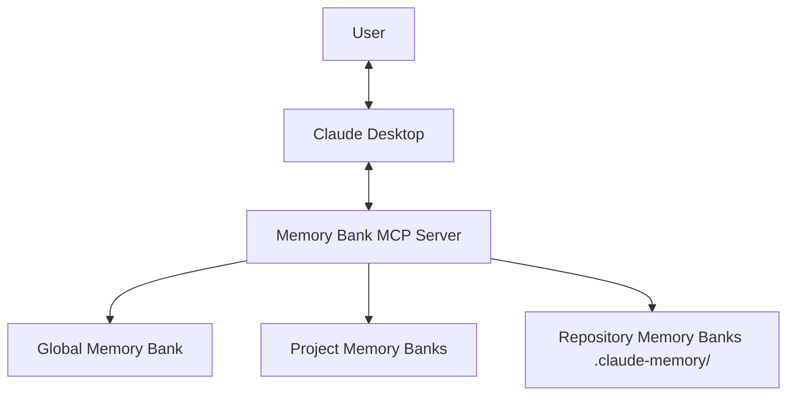
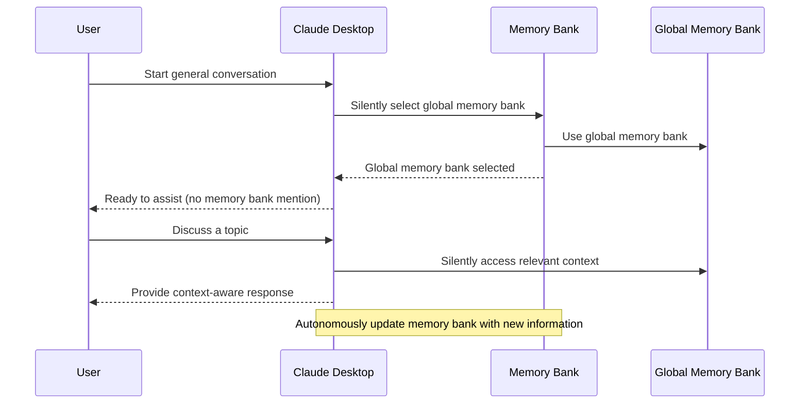
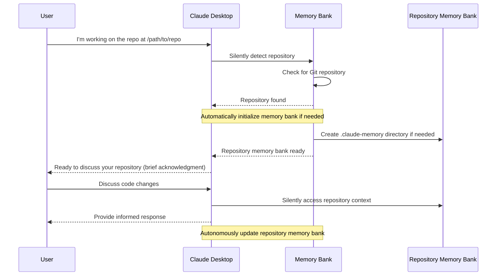
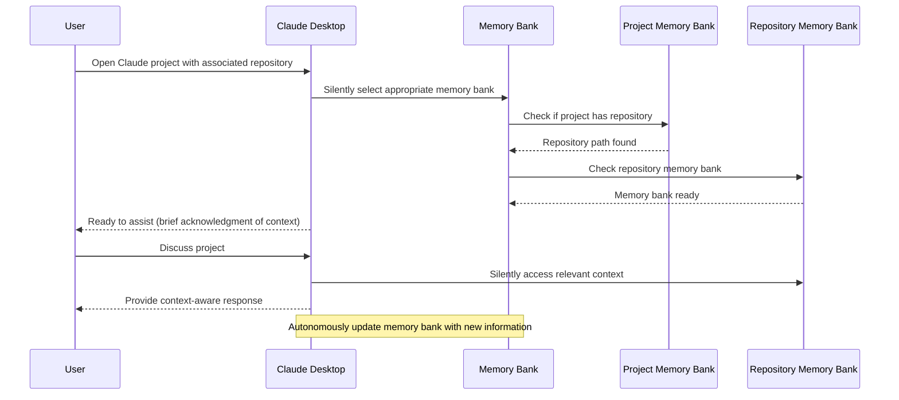

# Claude Desktop Memory Bank - Usage Guide

This guide explains how the Claude Desktop Memory Bank works as an autonomous context management system.

## Introduction

The Claude Desktop Memory Bank is a Model Context Protocol (MCP) server that enables Claude to maintain context and memory across sessions. It functions as Claude's auxiliary memory, automatically storing and organizing important information without requiring user management.

The system supports three types of memory banks:
1. **Global Memory Bank**: For general conversations not tied to specific projects
2. **Project Memory Banks**: Linked to Claude Desktop projects
3. **Repository Memory Banks**: Located inside Git repositories for code-related work



## Installation

### Prerequisites

- Claude Desktop app installed
- Python 3.8 or newer
- Node.js (required for Claude Desktop MCP integration)
- Git (for repository memory banks)

### Installation Steps

1. **Clone the repository**:
   ```bash
   git clone https://github.com/yourusername/claude-desktop-memory-bank.git
   cd claude-desktop-memory-bank
   ```

2. **Install the memory bank server**:
   ```bash
   pip install -e .
   ```

3. **Configure Claude Desktop**:
   
   Locate the Claude Desktop configuration file:
   - **macOS**: `~/Library/Application Support/Claude/claude_desktop_config.json`
   - **Windows**: `%APPDATA%\Claude\claude_desktop_config.json`
   
   Add the memory bank server configuration:
   ```json
   {
     "mcpServers": {
       "memory-bank": {
         "command": "python",
         "args": ["-m", "memory_bank_server"],
         "env": {
           "MEMORY_BANK_ROOT": "/path/to/your/storage/directory",
           "ENABLE_REPO_DETECTION": "true"
         }
       }
     }
   }
   ```

4. **Restart Claude Desktop**:
   Close and reopen the Claude Desktop application.

## Memory Bank Types

### Global Memory Bank

The global memory bank is used for general conversations that aren't associated with a specific project or repository:

- Used by default when no other memory bank is specified
- Stores general context that can be accessed across conversations
- Provides continuity for non-project-specific discussions

### Project Memory Banks

Project memory banks are linked to Claude Desktop projects:

- Each Claude Desktop project can have its own dedicated memory bank
- Stores project-specific context, progress, and technical details
- Automatically loaded when you switch to a Claude Desktop project

### Repository Memory Banks

Repository memory banks are stored directly within Git repositories:

- Located in a `.claude-memory` directory at the repository root
- Context is stored with your code and can be committed to version control
- Ideal for development work where context should follow the codebase
- Can be associated with Claude Desktop projects for easy access

## How It Works

### Autonomous Memory Bank Selection

When starting a conversation, Claude automatically selects the appropriate memory bank:

1. **In a Claude Desktop Project**:
   - If the project has an associated repository, Claude uses the repository memory bank
   - If no repository is associated, Claude uses the project memory bank
   - Claude briefly informs you which memory bank is being used

2. **Outside of a Project**:
   - Claude uses the global memory bank by default
   - You can mention a specific project or repository to switch contexts

3. **Working with a Repository**:
   - Simply mention the repository you're working with
   - Claude automatically detects Git repositories and initializes memory banks if needed
   - The repository memory bank is selected without requiring confirmation

### Creating Your First Project Memory Bank

1. **Open Claude Desktop** and start a new conversation
2. **Mention creating a project**:
   ```
   I'd like to create a new project called "MyProject"
   ```
3. **Claude automatically creates the project**:
   - Claude sets up the necessary memory bank structure
   - No confirmation steps needed
4. **Discuss your project**:
   ```
   This project will be a web application for tracking inventory
   ```
5. **Claude automatically stores important information** in the appropriate context files
6. **Information persists** for future conversations about this project

### Working with Repository Memory Banks

1. **Mention your repository**:
   ```
   I'm working on a project in the repository at /path/to/repo
   ```
2. **Claude automatically detects the repository**:
   - It checks if a memory bank already exists
   - If not, it initializes one without requiring confirmation
3. **Continue your conversation** about the code:
   - Claude remembers details about the repository
   - Important information is saved automatically
   - No explicit management required

### Connecting Projects and Repositories

Simply mention both in conversation:
```
My "InventoryApp" project uses the code in /path/to/inventory-repo
```

Claude automatically:
- Associates the project with the repository
- Ensures future conversations about this project use the repository memory bank
- Preserves this association for future sessions

## Using Memory Banks

### Seamless Context Awareness

Claude automatically leverages saved context:

1. **Remembers previous discussions** without you having to remind it
2. **Recalls technical decisions** made in earlier conversations
3. **Understands project requirements** without repetition
4. **Maintains awareness** of progress and outstanding tasks

### Checking Memory Bank Status

If you're curious about the current memory bank:

```
What memory bank are we using right now?
```

Claude will provide information about:
- The current memory bank type (global, project, or repository)
- Repository details if using a repository memory bank
- Project details if using a project memory bank

### Switching Memory Banks

To switch contexts, simply mention the new focus:

```
Let's talk about my "Analytics" project instead
```

Or:

```
I'm now working in my /path/to/different-repo repository
```

Claude automatically detects context switches and selects the appropriate memory bank.

## Behind the Scenes

While you don't need to interact directly with the memory bank system, it's helpful to understand what's happening in the background.

### How Claude Updates Context

Claude automatically:

1. **Monitors conversations** for important information
2. **Categorizes information** into appropriate context types:
   - `project_brief`: High-level project information
   - `product_context`: Problem, solution, and user experience details
   - `system_patterns`: Architecture and technical design decisions
   - `tech_context`: Technologies, setup, and dependencies
   - `active_context`: Current focus and recent changes
   - `progress`: Work status tracking

3. **Persists key information** at appropriate times:
   - During conversations when important information emerges
   - At the end of conversations to ensure nothing is lost
   - When switching between contexts

### Advanced Memory Management

Claude employs several advanced techniques to maintain optimal memory:

1. **Bulk Updates**: When information affects multiple context areas, Claude updates them together to maintain consistency.

2. **Auto-Summarization**: During complex conversations, Claude automatically extracts key points and organizes them into appropriate context files.

3. **Context Pruning**: Claude periodically removes outdated information to keep the memory bank relevant and focused on current work.

These processes happen automatically in the background without requiring your attention or approval.

### Automatic Context Application

Claude seamlessly uses stored information to:

1. **Understand references** to previously discussed components
2. **Maintain awareness** of project goals and requirements
3. **Recall technical decisions** without requiring repetition
4. **Track progress** across multiple conversations

## Workflow Examples

### Autonomous Global Context Workflow



### Autonomous Repository Context Workflow



### Autonomous Project with Repository Workflow



## Best Practices

### Getting the Most from Memory Banks

1. **Mention project and repository names clearly**:
   - "I'm working on the InventoryApp project"
   - "This is for the repository at /path/to/repo"

2. **Discuss important decisions explicitly**:
   - Architectural choices
   - Technical constraints
   - Project requirements
   - Implementation details

3. **For teams using shared repositories**:
   - Commit `.claude-memory` to Git for team sharing
   - Pull before starting new conversations to get latest context

## Troubleshooting

### Memory Bank Server Issues

If Claude seems to have forgotten previous context:

1. **Check server status**:
   - Ensure the memory bank server is running
   - Check configuration in `claude_desktop_config.json`

2. **Check logs** for errors:
   - Logs are at `~/Library/Logs/Claude/mcp-server-memory-bank.log` (macOS)
   - Or `%APPDATA%\Claude\logs` (Windows)

3. **Restart server if needed**:
   ```bash
   python -m memory_bank_server
   ```

### Repository Detection Issues

If Claude doesn't seem to recognize your repository:

1. **Use explicit absolute paths**:
   - `/home/user/projects/my-repo` instead of `~/projects/my-repo`

2. **Ensure repository has a `.git` directory**:
   - Must be a valid Git repository

3. **Check parent directories**:
   - Sometimes the root of the repository is higher than expected

## Conclusion

The Claude Desktop Memory Bank enhances your interactions with Claude by providing persistent context across sessions without requiring manual management. By automatically selecting appropriate memory banks and silently updating context, Claude provides a seamless experience where important information is remembered without explicit instructions.

This autonomous system lets you focus on your work rather than managing Claude's memory, creating a more natural and efficient collaboration experience.
