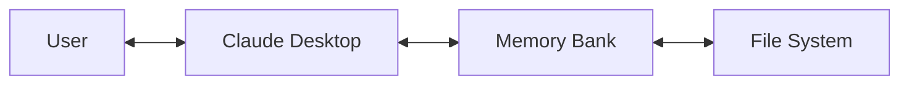
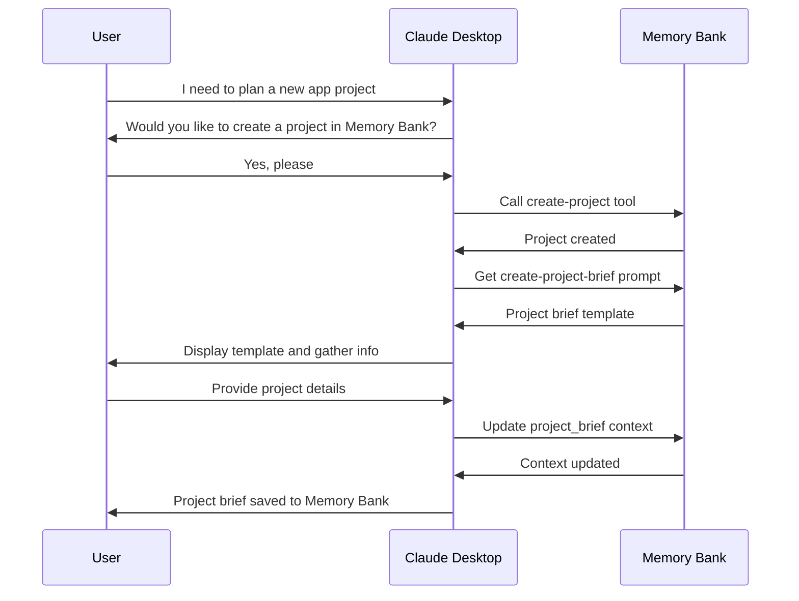
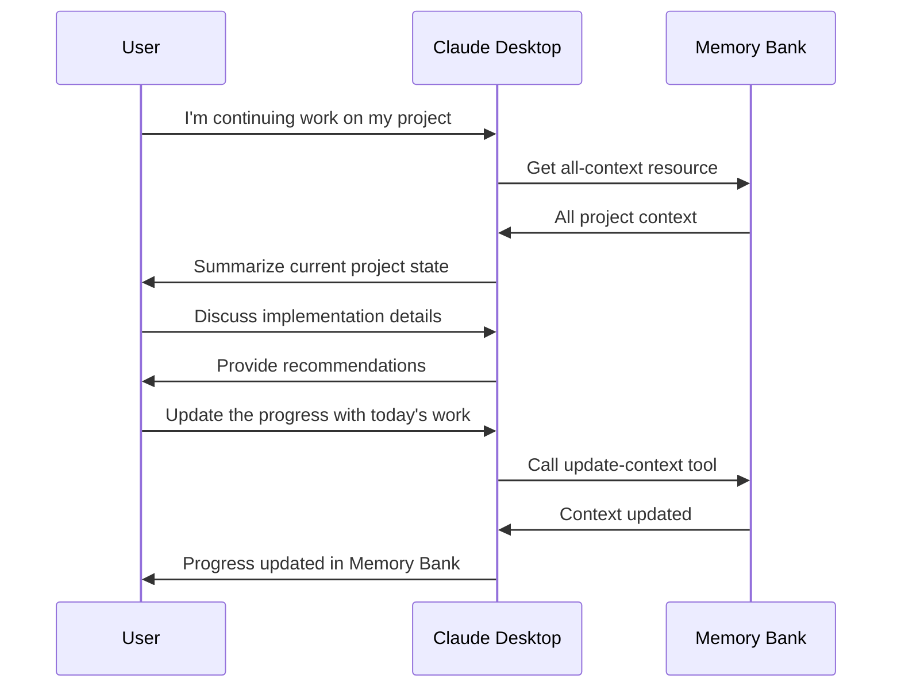

# Claude Desktop Memory Bank - Usage Guide

This guide explains how to use the Claude Desktop Memory Bank MCP server with Claude Desktop to maintain context across conversations.

## Introduction

The Claude Desktop Memory Bank is a Model Context Protocol (MCP) server that helps Claude Desktop maintain context and memory across sessions. It works by storing and organizing your project's context in a structured format that Claude can access when needed.



## Installation

### Prerequisites

- Claude Desktop app installed
- Python 3.8 or newer
- Node.js (required for Claude Desktop MCP integration)

### Installation Steps

1. **Clone the repository**:
   ```bash
   git clone https://github.com/yourusername/claude-desktop-memory-bank.git
   cd claude-desktop-memory-bank
   ```

2. **Install the memory bank server**:
   ```bash
   pip install -e .
   ```

3. **Configure Claude Desktop**:
   
   Locate the Claude Desktop configuration file:
   - **macOS**: `~/Library/Application Support/Claude/claude_desktop_config.json`
   - **Windows**: `%APPDATA%\Claude\claude_desktop_config.json`
   
   Add the memory bank server configuration:
   ```json
   {
     "mcpServers": {
       "memory-bank": {
         "command": "python",
         "args": ["-m", "memory_bank_server"],
         "env": {
           "MEMORY_BANK_ROOT": "/path/to/your/storage/directory"
         }
       }
     }
   }
   ```

4. **Restart Claude Desktop**:
   Close and reopen the Claude Desktop application.

## Getting Started

### Creating Your First Project

1. **Open Claude Desktop** and start a new conversation.

2. **Check that the MCP server is loaded**:
   Look for the tool icon in the bottom bar of Claude Desktop. When clicked, it should show the memory bank tools.

3. **Create a project**:
   Ask Claude to create a new project using the memory bank. For example:
   ```
   I'd like to create a new project in the memory bank. Can you help me with that?
   ```

4. **Claude will use the `create-project` tool**:
   Claude will ask for permission to use the tool and prompt you for project details like name and description.

5. **Create a project brief**:
   After creating the project, ask Claude to help you create a project brief:
   ```
   Can you help me create a detailed project brief for this project?
   ```

6. **Claude will use the `create-project-brief` prompt**:
   This will provide a template for creating a comprehensive project brief.

7. **Update the memory bank**:
   Once you've created your project brief, ask Claude to update the memory bank:
   ```
   Please update the project brief in the memory bank with this information.
   ```

### Using Context in Conversations

Once you have a project set up, you can:

1. **Ask for context**:
   ```
   What was the purpose of this project according to the memory bank?
   ```

2. **Update context**:
   ```
   I've made progress on feature X. Could you update the active context in the memory bank to reflect this?
   ```

3. **Search context**:
   ```
   Can you search the memory bank for anything related to "API integration"?
   ```

## Available Tools and Resources

### Tools

The Memory Bank provides the following tools:

1. **`create-project`**: Create a new project in the memory bank
   ```
   Parameters:
   - name: The name of the project
   - description: A brief description of the project
   ```

2. **`set-active-project`**: Change the currently active project
   ```
   Parameters:
   - name: The name of the project to set as active
   ```

3. **`list-projects`**: List all available projects
   ```
   Parameters: None
   ```

4. **`update-context`**: Update a context file
   ```
   Parameters:
   - context_type: Type of context (project_brief, product_context, system_patterns, tech_context, active_context, progress)
   - content: The new content for the file
   ```

5. **`search-context`**: Search through context files
   ```
   Parameters:
   - query: Search term to look for
   ```

### Resources

The Memory Bank provides these resources:

1. **`project-brief`**: The project brief document
2. **`active-context`**: The current active context
3. **`progress`**: Project progress information
4. **`all-context`**: Combined view of all context files

### Prompts

The Memory Bank provides these prompt templates:

1. **`create-project-brief`**: Template for creating a project brief
2. **`create-update`**: Template for creating progress updates

## Workflow Examples

### Project Planning Workflow



### Development Session Workflow



## Best Practices

1. **Start with a detailed project brief**:
   The more detail you provide in your project brief, the better Claude can assist you.

2. **Regularly update progress**:
   Keep the progress and active context up to date for the best continuity across sessions.

3. **Use context references in conversations**:
   Ask Claude to refer to specific parts of the memory bank when discussing topics.

4. **Maintain clear context boundaries**:
   Keep different aspects of your project in the appropriate context files.

5. **Review context periodically**:
   Ask Claude to show you the current state of context files regularly to ensure accuracy.

## Troubleshooting

### Memory Bank Server Not Appearing in Claude

If you don't see the memory bank tools in Claude Desktop:

1. **Check configuration**:
   Make sure the `claude_desktop_config.json` file is correctly set up.

2. **Check logs**:
   Look for error messages in the Claude logs:
   - macOS: `~/Library/Logs/Claude/mcp-server-memory-bank.log`
   - Windows: Check Event Viewer or `%APPDATA%\Claude\logs`

3. **Run manually**:
   Try running the server manually to see any error output:
   ```bash
   python -m memory_bank_server
   ```

### Context Not Updating

If context updates aren't working:

1. **Check active project**:
   Make sure you have a project selected. Use the `list-projects` tool to see available projects.

2. **Check file paths**:
   Ensure the `MEMORY_BANK_ROOT` environment variable points to a writable directory.

3. **Check permissions**:
   Ensure that the user running Claude Desktop has write permissions to the storage directory.

## Conclusion

The Claude Desktop Memory Bank enhances your interactions with Claude by providing persistent context across sessions. By following this guide, you can effectively manage your project context and have more productive conversations with Claude Desktop.

For developers looking to modify or extend the Memory Bank, please refer to the Implementation Guide.
