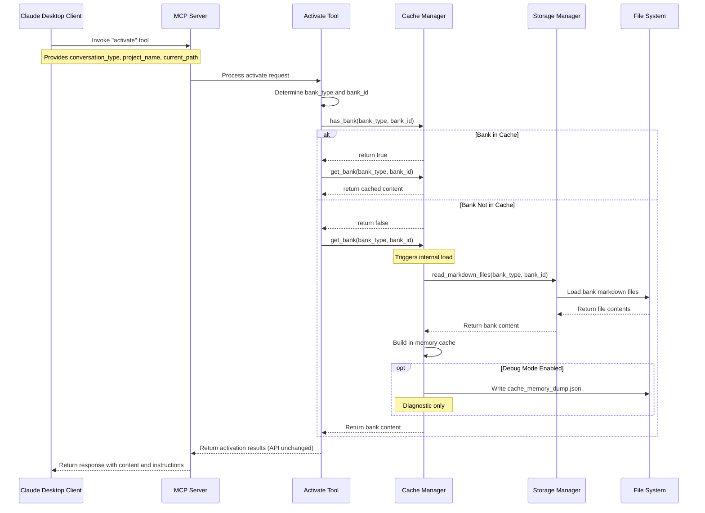
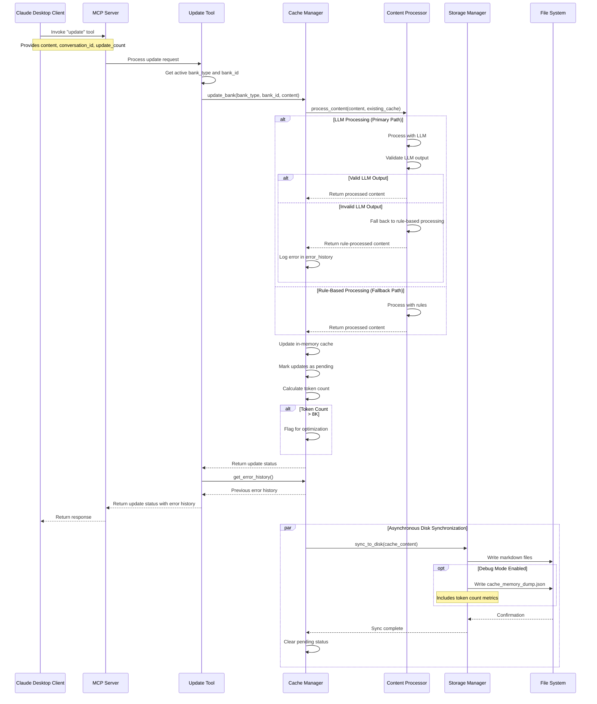
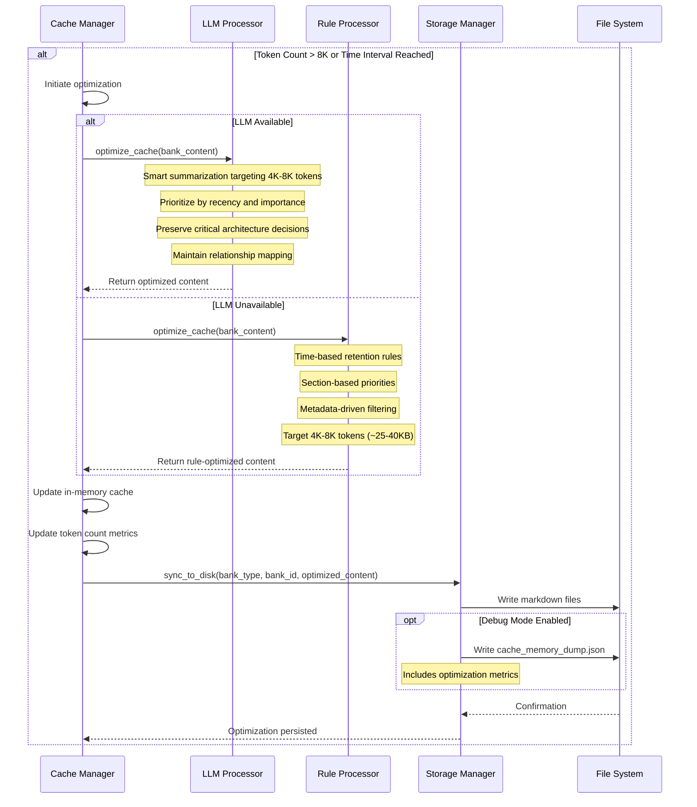

# Memory Bank Improvement Proposal #02

## Status: Under Review

Possible status values:
- **Under Review**: Proposal is being evaluated by the team
- **Approved**: Proposal has been accepted and is ready for implementation
- **Under Development**: Implementation is in progress
- **Completed**: Implementation is finished and deployed

## Background and Motivation

The current Memory Bank implementation suffers from several inefficiencies:

1. **Inefficient Content Processing**: Each operation reads files directly from disk, causing unnecessary I/O overhead for frequently accessed memory banks
2. **Redundant Processing**: Content analysis and organization is performed without caching previous results
3. **Unclear Cache Benefits**: The current cache system is maintained but its benefits aren't clearly realized in the codebase
4. **Disconnected Tool Operations**: Activate and Update tools operate independently without a shared state mechanism

These issues stem from a file-centric architecture rather than a memory-centric one. Shifting to an in-memory cache design with persistent storage as a backing store would significantly improve performance and enable more sophisticated features.

## Proposed Changes

### 2.1 In-Memory Cache Architecture

**Centralized Cache Manager:**
- Implement a shared in-memory dictionary of active memory banks
- Keyed by `{bank_type}:{bank_id}` for unique identification
- Contains complete content from the bank's files
- Acts as the primary source of truth during operation

**Cache Evolution:**
- The cache.json file has been superseded by cache_memory_dump.json
- Existing tooling for cache.json can be repurposed for the new debug dump
- No operational dependency on cache_memory_dump.json - purely diagnostic
- Enabled by default during development (`debug_memory_dump=True`)

**Debug Memory Dump:**
- Optional memory dump to cache_memory_dump.json for troubleshooting
- Enabled by default during development (debug_memory_dump=True)
- Contains complete serialization of in-memory cache state
- Not used for loading - purely diagnostic

**Cache Lifecycle:**
- Loaded during first activation or update
- Updated synchronously in memory when content changes
- Synchronized to markdown files on disk every 60 seconds (configurable parameter with default value)
- If a large update is received, synchronization happens immediately after content processing
- Risk of server failure between updates is accepted; no specific recovery procedures needed
- Disk synchronization uses a FIFO queue to prevent race conditions between updates
- Synchronization errors are propagated to clients through the error history mechanism

**Cache API Consistency:**
- The `activate` tool will continue to return the exact same data structure as before:
  - Complete memory bank content (from cache when available)
  - Custom instructions (unchanged)
  - Prompts (unchanged)
- API contracts and return formats remain consistent despite the internal implementation changes
- Clients will experience no interface changes while benefiting from performance improvements

**Prioritization Strategy:**
- In-memory cache is the authoritative source during runtime
- Markdown files are the persistent storage on disk
- On load: read from markdown files to build cache
- On update: update in-memory cache first, then periodically synchronize to markdown files

### 2.2 Coordinated Tool Implementation

**Update Tool Enhancements:**
- Automatically loads banks into cache if not already present
- Adds content to memory first, then persists to disk
- Uses fully asynchronous processing for all operations
- The `update` tool will continue to return the same data structure as before
- When content is updated, the cache is modified first, then persisted to disk
- Includes a lightweight error reporting mechanism that returns previous errors on subsequent calls
- No dedicated status endpoint; assumes operations complete successfully in the background
- Returns a simplified format with error history:
  ```json
  {
    "status": "success",
    "previous_errors": [
      {"timestamp": "2025-04-10T14:32:10Z", "description": "Failed to process content for doc/design.md", "severity": "warning"}
    ]
  }
  ```

**Activate Tool Enhancements:**
- Checks for existing cached banks before loading from disk
- Provides optimized content from cache when available
- Returns cache metadata to improve client awareness

### 2.3 Intelligent Content Organization

**Content Processing:**
*Purpose: Analyze new conversation content to determine appropriate categorization, storage location, and contextual relationships*

- **Primary Path (LLM-based)**: Leverages LLM capabilities to:
    - Semantically analyze content for optimal categorization
    - Identify relationships between new and existing information  
    - Determine appropriate markdown file targets and section placement
    - Extract key concepts and metadata for improved retrieval

- **Fallback Path (Rule-based)**: Deterministic algorithm implementation for reliable operation when LLM processing is unavailable:
    - Keyword and pattern matching for content categorization
    - Explicit file targeting based on predefined rules
    - Time-based organization with automatic timestamping
    - Structured metadata extraction using regex patterns

- **Standard Processing Interface**:
    - No content truncation during initial processing
    - Consistent output format regardless of processing path used
    - Standardized schema: `{target_file, operation_type, content, metadata}`
    - Validation layer to verify LLM outputs against established constraints
    - Uniform error handling with graceful degradation between paths

**Continuous Cache Optimization:**
*Purpose: Intelligently reduce cache size to 4K-8K tokens (approximately 25-40KB) while preserving the most valuable information based on recency and importance*

- **Primary Path (LLM-based)**:
    - Scheduled optimization runs triggered by size thresholds or time intervals
    - Content prioritization based on multiple weighted factors:
        - Current architecture decisions (historical designs clearly marked)
        - Project scope definition and conversation context
        - Active objectives and development milestones
        - Technical decision history with explicit rationales
        - Implementation patterns currently in use
        - Critical dependencies and system constraints
        - Recent development activities and progress markers
    - Explicit relationship mapping between related content elements
    - Version tracking with clear indicators for current vs. historical information

- **Fallback Path (Rule-based)**: Deterministic alternative when LLM optimization is unavailable:
    - Time-based retention rules (prioritize recent content)
    - Section-based priorities (architecture > implementation > discussion)
    - Metadata-driven filtering to preserve tagged critical information
    - Fixed summarization rules for predictable results

## Components Impacted

### 3.1 Cache Manager

**New Component:**
```python
class CacheManager:
    """Manages the in-memory cache of memory banks."""
    
    def __init__(self, debug_memory_dump=True):
        """Initialize the cache manager with optional debug dump support."""
        self.cache = {}  # Dictionary mapping bank keys to content
        self.debug_memory_dump = debug_memory_dump
        self.last_sync_time = {}  # Track last disk synchronization by bank
        self.pending_updates = {}  # Track updates pending disk synchronization
        self.error_history = []  # Store recent processing errors
        self.sync_queue = Queue()  # FIFO queue for synchronization operations
        self._sync_thread = None  # Background thread for disk synchronization
        
    def get_bank_key(self, bank_type, bank_id):
        """Generate a unique key for a bank."""
        return f"{bank_type}:{bank_id}"
        
    def has_bank(self, bank_type, bank_id):
        """Check if a bank exists in the cache."""
        return self.get_bank_key(bank_type, bank_id) in self.cache
        
    def get_bank(self, bank_type, bank_id):
        """Get a bank from the cache or load it if missing."""
        key = self.get_bank_key(bank_type, bank_id)
        if key not in self.cache:
            # Load from disk and build cache
            self._load_bank_from_disk(bank_type, bank_id)
        return self.cache[key]
        
    def update_bank(self, bank_type, bank_id, content):
        """Update a bank's content in memory."""
        key = self.get_bank_key(bank_type, bank_id)
        if key not in self.cache:
            self._load_bank_from_disk(bank_type, bank_id)
            
        # Process the content and update in-memory cache
        try:
            updated_content = self._process_content(content, self.cache[key])
            self.cache[key] = self._merge_content(self.cache[key], updated_content)
            self.pending_updates[key] = True
            self._schedule_disk_sync(bank_type, bank_id)
            return {"status": "success"}
        except Exception as e:
            error = {
                "timestamp": datetime.utcnow().isoformat() + "Z",
                "description": str(e),
                "severity": "error"
            }
            self.error_history.append(error)
            # Error history is returned to client on next operation call
            # For repeated disk sync failures, errors are propagated to client
            return {"status": "error", "error": str(e)}
            
    def _load_bank_from_disk(self, bank_type, bank_id):
        """Load bank content from disk files into memory cache."""
        # Implementation to read markdown files and build cache structure
        
    def _process_content(self, content, existing_cache):
        """Process content using LLM-based or rule-based approach."""
        try:
            # Try LLM-based processing first
            # LLM prompts are maintained externally to the code for easier iteration
            # LLM processing is handled through a separate LLMProcessor class
            # that abstracts away the specific LLM implementation details
            return self._process_with_llm(content, existing_cache)
        except Exception as e:
            # Log the failure but don't stop operation
            logging.warning(f"LLM processing failed: {str(e)}")
            # Fall back to rule-based processing
            # This handles cases where LLM is unavailable or returns invalid results
            # Also handles extremely large content that LLM cannot process
            return self._process_with_rules(content, existing_cache)
            
    def _schedule_disk_sync(self, bank_type, bank_id):
        """Schedule an asynchronous disk synchronization."""
        # Implementation for disk sync (every 60s by default)
        # Large updates trigger immediate synchronization after processing
        # Uses a FIFO queue for synchronization operations
        # Each sync operation completes before the next one begins
        
    def get_error_history(self):
        """Return recent processing errors."""
        return self.error_history[-10:] if self.error_history else []
        
    def dump_debug_memory(self):
        """Write current cache state to cache_memory_dump.json if debug enabled."""
        if not self.debug_memory_dump:
            return
            
        try:
            # Calculate approximate token count for monitoring purposes
            total_tokens = 0
            for bank_key, content in self.cache.items():
                # Estimate 4 characters per token as a simple approximation
                bank_size = sum(len(str(item)) for item in content.values()) // 4
                total_tokens += bank_size
                logging.info(f"Bank {bank_key}: ~{bank_size} tokens")
            
            logging.info(f"Total cache size: ~{total_tokens} tokens")
            
            with open('cache_memory_dump.json', 'w') as f:
                json.dump(self.cache, f, indent=2)
        except Exception as e:
            logging.error(f"Failed to write debug memory dump: {e}")
```

### 3.2 Tool Implementations

**Activate Tool Modifications:**
```python
@server.tool(
    name="activate",
    description="Activates memory for the current conversation"
)
async def activate(
    conversation_type: str,
    project_name: Optional[str] = None,
    current_path: Optional[str] = None,
    project_description: Optional[str] = None
) -> Dict[str, Any]:
    # Determine bank type and ID
    bank_type = _determine_bank_type(conversation_type)
    bank_id = _determine_bank_id(bank_type, project_name, current_path)
    
    # Get bank content from cache if available
    if cache_manager.has_bank(bank_type, bank_id):
        content = cache_manager.get_bank(bank_type, bank_id)
    else:
        # Load from disk through cache manager
        content = cache_manager.get_bank(bank_type, bank_id)
    
    # Return identical API structure as before for backward compatibility
    return {
        "status": "success",
        "bank_info": {
            "type": bank_type,
            "id": bank_id,
            "files": list(content.keys()),  # File names remain consistent
            "last_updated": _get_last_updated_time(bank_type, bank_id)
        },
        "content": content,
        "custom_instructions": _get_custom_instructions(bank_type)
    }
```

**Update Tool Modifications:**
```python
@server.tool(
    name="update",
    description="Updates memory with conversation content"
)
async def update(
    content: str,
    conversation_id: Optional[str] = None,
    update_count: Optional[int] = None
) -> Dict[str, Any]:
    # Use the currently active bank information
    bank_type, bank_id = _get_active_bank_info()
    
    # Update the in-memory cache
    result = cache_manager.update_bank(bank_type, bank_id, content)
    
    # Return a simplified response with any error history
    if result["status"] == "success":
        return {
            "status": "success",
            "previous_errors": cache_manager.get_error_history()
        }
    else:
        return {
            "status": "error",
            "error": result["error"],
            "previous_errors": cache_manager.get_error_history()
        }
```

### 3.3 Storage Integration

**Bank Class Modifications:**
```python
class MemoryBank:
    """Base class for memory banks with cache integration."""
    
    def sync_to_disk(self, cache_content):
        """Synchronize in-memory cache content to disk files."""
        # Implementation to write markdown files based on cache content
        for file_name, content in cache_content.items():
            self._write_file(file_name, content)
        
        # Update cache_memory_dump.json if debug mode is enabled
        if self.debug_memory_dump:
            self._write_debug_memory_dump(cache_content)
            
    def _write_file(self, file_path, content):
        """Write content to a markdown file, ensuring directory exists."""
        # Implementation
        
    def _write_debug_memory_dump(self, cache_content):
        """Write diagnostic memory dump for debugging."""
        # Implementation
```

## Workflow Diagrams

### Activate Flow Diagram



### Update Flow Diagram



### Cache Optimization Flow Diagram



## Initialization Process

The CacheManager is implemented as a singleton that starts with an empty cache. When a memory bank operation is needed:

1. **Lazy Initialization**: The CacheManager initializes blank and only loads banks when they're requested
2. **Active Bank Tracking**: Banks are uniquely identified by their `{bank_type}:{bank_id}` key
3. **On-Demand Loading**: When a bank is requested but not in memory, it's loaded from disk automatically
4. **Default Configuration**: Initial implementation uses default settings:
   - Debug mode enabled (debug_memory_dump=True)
   - 60-second synchronization interval
   - No specific recovery procedures for interrupted operations

## Implementation Plan

### Phase 1: Core Cache Manager
1. Create the CacheManager class with in-memory dictionary
2. Implement bank key generation and lookup methods
3. Add basic memory manipulation operations
4. Implement debug memory dump functionality
5. Write tests for core cache operations

### Phase 2: Markdown File Integration
1. Develop file reading routines to populate cache
2. Create disk synchronization mechanism
3. Implement FIFO queue for background sync operations (60s intervals)
4. Implement synchronization queue with sequential processing
5. Write tests for file I/O operations

### Phase 3: Update Tool Integration
1. Modify update tool to use cache manager
2. Implement primary and fallback content processing paths
3. Add error history tracking and reporting
4. Update synchronization logic based on modified content
5. Update tests for the new update flow

### Phase 4: Activate Tool Integration
1. Modify activate tool to check cache first
2. Maintain backward compatibility in return format
3. Add informational cache metadata to responses
4. Implement cache-aware error handling
5. Update tests for the new activate flow

### Phase 5: Content Processing Enhancement
1. Develop both LLM-based and pattern-based processors
2. Implement the standardized processing interface
3. Add validation layer for LLM outputs
4. Create content merging logic for incremental updates
5. Externalize LLM prompts for easier iteration and improvement
6. Add comprehensive tests for content processing

### Phase 6: Diagnostics and Monitoring
1. Implement comprehensive logging for all cache operations
2. Add performance metrics collection
3. Create debug views for cache state inspection
4. Develop recovery mechanisms for inconsistent states
5. Add automated tests for failure scenarios

