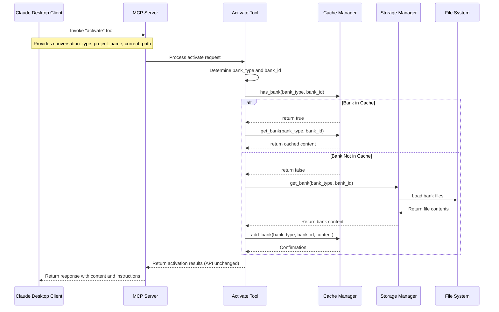
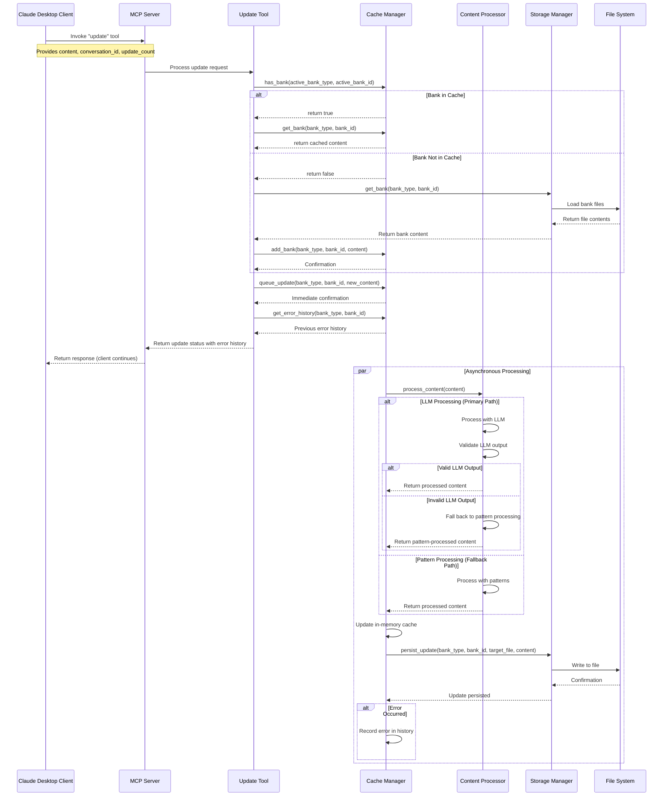
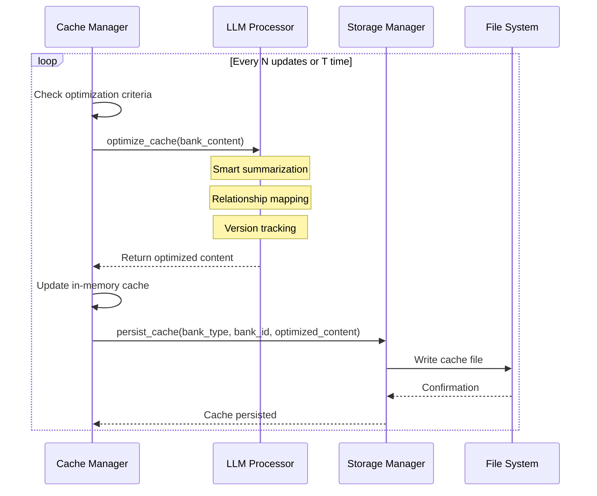

# Memory Bank Improvement Proposal #02

## Status: Under Review

Possible status values:
- **Under Review**: Proposal is being evaluated by the team
- **Approved**: Proposal has been accepted and is ready for implementation
- **Under Development**: Implementation is in progress
- **Completed**: Implementation is finished and deployed

## Background and Motivation

The current Memory Bank implementation suffers from several inefficiencies:

1. **Inefficient Content Processing**: Each operation reads files directly from disk, causing unnecessary I/O overhead for frequently accessed memory banks
2. **Redundant Processing**: Content analysis and organization is performed without caching previous results
3. **Unclear Cache Benefits**: The current cache system is maintained but its benefits aren't clearly realized in the codebase
4. **Disconnected Tool Operations**: Activate and Update tools operate independently without a shared state mechanism

These issues stem from a file-centric architecture rather than a memory-centric one. Shifting to an in-memory cache design with persistent storage as a backing store would significantly improve performance and enable more sophisticated features.

## Proposed Changes

### 2.1 In-Memory Cache Architecture

**Centralized Cache Manager:**
- Implement a shared in-memory dictionary of active memory banks
- Keyed by `{bank_type}:{bank_id}` for unique identification
- Contains complete content from the bank's files
- Acts as the primary source of truth during operation

**Cache Lifecycle:**
- Loaded during first activation or update
- Updated synchronously when content changes
- Periodically persisted to disk
- Optimized asynchronously without blocking operations

**Cache API Consistency:**
- The `activate` tool will continue to return the exact same data structure as before:
  - Complete memory bank content (from cache when available)
  - Custom instructions (unchanged)
  - Prompts (unchanged)
- API contracts and return formats remain consistent despite the internal implementation changes
- Clients will experience no interface changes while benefiting from performance improvements

**Prioritization Strategy:**
- Memory cache is always the authoritative source when available
- File system is the fallback and persistence layer

### 2.2 Coordinated Tool Implementation

**Update Tool Enhancements:**
- Automatically loads banks into cache if not already present
- Adds content to memory first, then persists to disk
- Uses fully asynchronous processing for all operations
- The `update` tool will continue to return the same data structure as before
- When content is updated, the cache is modified first, then persisted to disk
- Includes a lightweight error reporting mechanism that returns previous errors on subsequent calls
- No dedicated status endpoint; assumes operations complete successfully in the background
- Returns a simplified format with error history:
  ```json
  {
    "status": "success",
    "previous_errors": [
      {"timestamp": "2025-04-10T14:32:10Z", "description": "Failed to process content for doc/design.md", "severity": "warning"}
    ]
  }
  ```

**Activate Tool Enhancements:**
- Checks for existing cached banks before loading from disk
- Provides optimized content from cache when available
- Returns cache metadata to improve client awareness

### 2.3 Intelligent Content Organization

**Two-Tier Content Processing:**
- **Primary Path (LLM-based)**: Leverages LLM capabilities to:
    - Semantically analyze content for optimal categorization
    - Identify relationships between new and existing information
    - Determine appropriate file targets and section placement
    - Extract key concepts and metadata

- **Fallback Path (Pattern-based)**: Basic compiled code for essential functionality when LLM is unavailable:
    - Simple keyword matching for basic categorization
    - Predefined file targeting rules
    - Timestamp-based organization

- **Standard Processing Interface**:
    - Both paths produce identical output format structure
    - Output schema includes target file, operation type, content, and metadata
    - Post-processing validation layer checks LLM outputs for hallucinations or inconsistencies
    - Standardized error handling for processing failures

**Continuous Cache Improvement:**
- No truncation policy for raw content
- Periodic LLM-based optimization with validation checks
- Smart summarization preserving critical context, including:
  - Current architecture decisions (obsolete designs marked as historical)
  - Project/conversation purpose and scope
  - Active goals and objectives
  - Key technical decisions and their rationales
  - Implementation patterns in use
  - Important dependencies and constraints
  - Recent development progress
- Relationship mapping between content elements
- Version tracking to distinguish current vs. historical information

## Components Impacted

### 3.1 Cache Manager

**New Component:**
```python
class CacheManager:
    """Manages the in-memory cache of memory banks."""
    
    def __init__(self):
        """Initialize the cache manager."""
        self.cache = {}  # Dictionary mapping bank keys to content
        self.processing_queues = {}  # Processing queues by bank
        self.error_history = {}  # Track errors by bank key
        
    def get_bank_key(self, bank_type, bank_id):
        """Generate a unique key for a bank."""
        return f"{bank_type}:{bank_id}"
        
    def has_bank(self, bank_type, bank_id):
        """Check if a bank exists in the cache."""
        return self.get_bank_key(bank_type, bank_id) in self.cache
        
    def get_bank(self, bank_type, bank_id):
        """Get a bank from the cache or load it if missing."""
        # Implementation remains consistent with original API
        
    async def update_bank(self, bank_type, bank_id, content):
        """Queue an update to a bank's content. Returns immediately."""
        # Immediate queuing with asynchronous processing
        # Cache update happens first, then disk persistence
        
    def get_error_history(self, bank_type, bank_id):
        """Retrieve error history for a specific bank."""
        key = self.get_bank_key(bank_type, bank_id)
        return self.error_history.get(key, [])
        
    async def process_updates(self):
        """Process queued updates asynchronously."""
        # Implementation with two-tier processing strategy
        # Includes validation of LLM outputs
```

### 3.2 Tool Implementations

**Activate Tool Modifications:**
```python
@server.tool(
    name="activate",
    description="Activates memory for the current conversation"
)
async def activate(
    conversation_type: str,
    project_name: Optional[str] = None,
    current_path: Optional[str] = None
) -> Dict[str, Any]:
    # Determine bank type and ID
    
    # Check if bank is already in cache
    if cache_manager.has_bank(bank_type, bank_id):
        content = cache_manager.get_bank(bank_type, bank_id)
    else:
        # Load from disk as before
        content = bank.load_all_content()
        # Store in cache for future use
        await cache_manager.add_bank(bank_type, bank_id, content)
    
    # Return content and instructions in the EXACT SAME format
    # as before to maintain API consistency
```

**Update Tool Modifications:**
```python
@server.tool(
    name="update",
    description="Updates memory with conversation content"
)
async def update(
    content: str,
    conversation_id: Optional[str] = None,
    update_count: Optional[int] = None
) -> Dict[str, Any]:
    # Get currently active bank or load it
    
    # Queue the update in the cache manager - returns immediately
    await cache_manager.update_bank(bank_type, bank_id, content)
    
    # Get error history for reporting
    error_history = cache_manager.get_error_history(bank_type, bank_id)
    
    # Return simplified status with error history
    return {
        "status": "success",
        "previous_errors": error_history
    }
```

### 3.3 Storage Integration

**Bank Class Modifications:**
```python
class MemoryBank:
    """Base class for memory banks with cache integration."""
    
    async def update_from_cache(self, cache_content):
        """Update files from cache content."""
        # Asynchronous file operations
        
    async def load_into_cache(self):
        """Load content into cache."""
        # Implementation
        
    async def process_content(self, content, use_llm=True):
        """Process content using two-tier strategy."""
        if use_llm:
            try:
                # Primary path: LLM-based processing
                result = await self._process_with_llm(content)
                # Validate LLM output
                if self._validate_llm_output(result):
                    return result
                # Fall back if validation fails
            except Exception as e:
                # Log error and fall back
                pass
                
        # Fallback path: Pattern-based processing
        return self._process_with_patterns(content)
        
    def _validate_llm_output(self, result):
        """Validate LLM processing output for hallucinations/inconsistencies."""
        # Implementation
```

## Workflow Diagrams

### Activate Flow Diagram



### Update Flow Diagram



### Cache Optimization Flow Diagram



## Implementation Plan

### Phase 1: Cache Manager Implementation
1. Create the central CacheManager class
2. Implement basic in-memory storage and retrieval
3. Add bank loading from disk to cache
4. Add error history tracking functionality
5. Implement API compatibility layer
6. Write tests for cache operations

### Phase 2: Update Tool Integration
1. Modify update tool to use cache manager
2. Implement fully asynchronous processing
3. Add simplified error reporting
4. Maintain API contract compatibility
5. Update tests for the new update flow

### Phase 3: Activate Tool Integration
1. Modify activate tool to check cache first
2. Update the content retrieval logic
3. Add cache status to response
4. Ensure perfect API compatibility
5. Update tests for the new activate flow

### Phase 4: Content Organization Enhancement
1. Implement primary LLM-based content processor
2. Implement fallback pattern-based processor
3. Add validation layer for LLM outputs
4. Create standard processing interface
5. Implement improved content router
6. Create periodic optimization mechanism
7. Add tests for content organization

### Phase 5: Performance Optimization
1. Add metrics collection for cache operations
2. Implement smart cache eviction policies
3. Add background persistence for durability
4. Add LLM-based cache optimization with validation
5. Create performance benchmarks

