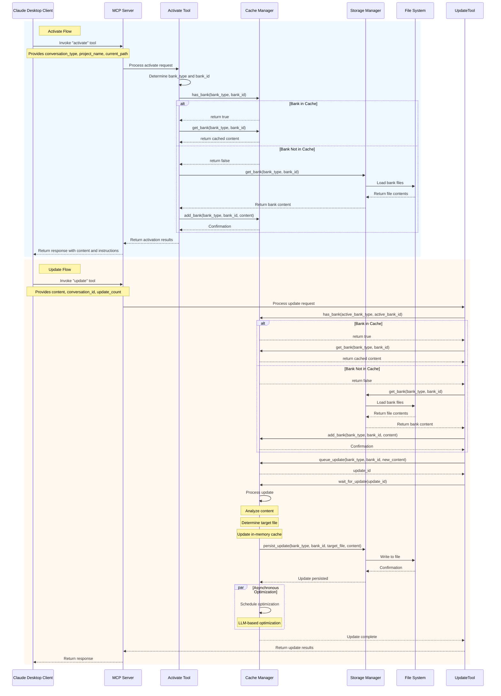

# Memory Bank Improvement Proposal #02

## Status: Under Review

## Background and Motivation

The current Memory Bank implementation suffers from several inefficiencies:

1. **Inefficient Content Processing**: Each operation reads files directly from disk, causing unnecessary I/O overhead for frequently accessed memory banks
2. **Redundant Processing**: Content analysis and organization is performed without caching previous results
3. **Unclear Cache Benefits**: The current cache system is maintained but its benefits aren't clearly realized in the codebase
4. **Disconnected Tool Operations**: Activate and Update tools operate independently without a shared state mechanism

These issues stem from a file-centric architecture rather than a memory-centric one. Shifting to an in-memory cache design with persistent storage as a backing store would significantly improve performance and enable more sophisticated features.

## Proposed Changes

### 2.1 In-Memory Cache Architecture

**Centralized Cache Manager:**
- Implement a shared in-memory dictionary of active memory banks
- Keyed by `{bank_type}:{bank_id}` for unique identification
- Contains complete content from the bank's files
- Acts as the primary source of truth during operation

**Cache Lifecycle:**
- Loaded during first activation or update
- Updated synchronously when content changes
- Periodically persisted to disk
- Optimized asynchronously without blocking operations

**Prioritization Strategy:**
- Memory cache is always the authoritative source when available
- File system is the fallback and persistence layer

### 2.2 Coordinated Tool Implementation

**Update Tool Enhancements:**
- Automatically loads banks into cache if not already present
- Adds content to memory first, then persists to disk
- Uses queue-based processing for content organization
- Supports both immediate and background processing

**Activate Tool Enhancements:**
- Checks for existing cached banks before loading from disk
- Provides optimized content from cache when available
- Returns cache metadata to improve client awareness

### 2.3 Intelligent Content Organization

**Two-Tier Content Processing:**
- Fast path: Pattern-based organization using compiled code
- Enhanced path: LLM-based organization for complex content
- Fallback mechanisms between the two paths

**Continuous Cache Improvement:**
- No truncation policy for raw content
- Periodic optimization of cached summaries and metadata
- LLM-based analysis of content relationships and importance

## Components Impacted

### 3.1 Cache Manager

**New Component:**
```python
class CacheManager:
    """Manages the in-memory cache of memory banks."""
    
    def __init__(self):
        """Initialize the cache manager."""
        self.cache = {}  # Dictionary mapping bank keys to content
        self.processing_queues = {}  # Processing queues by bank
        
    def get_bank_key(self, bank_type, bank_id):
        """Generate a unique key for a bank."""
        return f"{bank_type}:{bank_id}"
        
    def has_bank(self, bank_type, bank_id):
        """Check if a bank exists in the cache."""
        return self.get_bank_key(bank_type, bank_id) in self.cache
        
    def get_bank(self, bank_type, bank_id):
        """Get a bank from the cache or load it if missing."""
        # Implementation
        
    def update_bank(self, bank_type, bank_id, content):
        """Queue an update to a bank's content."""
        # Implementation
        
    def process_updates(self):
        """Process queued updates."""
        # Implementation
```

### 3.2 Tool Implementations

**Activate Tool Modifications:**
```python
@server.tool(
    name="activate",
    description="Activates memory for the current conversation"
)
async def activate(
    conversation_type: str,
    project_name: Optional[str] = None,
    current_path: Optional[str] = None
) -> Dict[str, Any]:
    # Determine bank type and ID
    
    # Check if bank is already in cache
    if cache_manager.has_bank(bank_type, bank_id):
        content = cache_manager.get_bank(bank_type, bank_id)
    else:
        # Load from disk as before
        content = bank.load_all_content()
        # Store in cache for future use
        cache_manager.add_bank(bank_type, bank_id, content)
    
    # Return content and instructions
```

**Update Tool Modifications:**
```python
@server.tool(
    name="update",
    description="Updates memory with conversation content"
)
async def update(
    content: str,
    conversation_id: Optional[str] = None,
    update_count: Optional[int] = None
) -> Dict[str, Any]:
    # Get currently active bank or load it
    
    # Queue the update in the cache manager
    update_id = cache_manager.update_bank(bank_type, bank_id, content)
    
    # For immediate updates, wait for processing to complete
    result = cache_manager.wait_for_update(update_id)
    
    # Return status
```

### 3.3 Storage Integration

**Bank Class Modifications:**
```python
class MemoryBank:
    """Base class for memory banks with cache integration."""
    
    def update_from_cache(self, cache_content):
        """Update files from cache content."""
        # Implementation
        
    def load_into_cache(self):
        """Load content into cache."""
        # Implementation
```

## Workflow Diagrams



## Implementation Plan

### Phase 1: Cache Manager Implementation
1. Create the central CacheManager class
2. Implement basic in-memory storage and retrieval
3. Add bank loading from disk to cache
4. Write tests for cache operations

### Phase 2: Update Tool Integration
1. Modify update tool to use cache manager
2. Implement queue-based processing for updates
3. Add synchronous and asynchronous update modes
4. Update tests for the new update flow

### Phase 3: Activate Tool Integration
1. Modify activate tool to check cache first
2. Update the content retrieval logic
3. Add cache status to response
4. Update tests for the new activate flow

### Phase 4: Content Organization Enhancement
1. Implement improved content router
2. Add LLM optimization with proper fallbacks
3. Create periodic optimization mechanism
4. Add tests for content organization

### Phase 5: Performance Optimization
1. Add metrics collection for cache operations
2. Implement smart cache eviction policies
3. Add background persistence for durability
4. Create performance benchmarks

## Status

**Under Review**

Possible status values:
- **Under Review**: Proposal is being evaluated by the team
- **Approved**: Proposal has been accepted and is ready for implementation
- **Under Development**: Implementation is in progress
- **Completed**: Implementation is finished and deployed